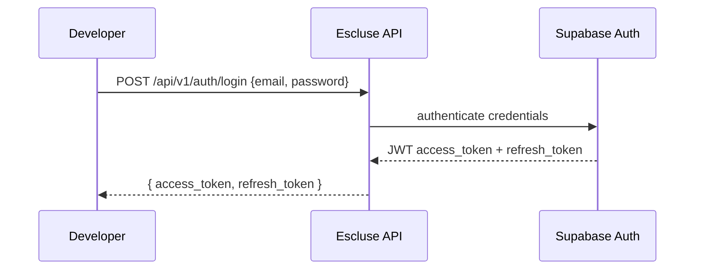

# Phase 52: Improve API Documentation - Pattern Map

**Mapped:** 2026-05-29
**Files analyzed:** 43 (4 modified, 37 new, 2 infrastructure)
**Analogs found:** 40 / 43

## File Classification

| New/Modified File | Role | Data Flow | Closest Analog | Match Quality |
|---|---|---|---|---|
| `docs/api/overview.md` | doc page | request-response | (existing file - restructure) | self |
| `docs/api/auth.md` | doc page | request-response | `docs/api/overview.md` | exact |
| `docs/api/servers.md` | doc page | CRUD | (existing file - expand) | self |
| `docs/api/nodes.md` | doc page | CRUD | `docs/api/servers.md` | exact |
| `docs/api/billing.md` | doc page | CRUD | `docs/api/servers.md` | exact |
| `docs/api/errors.md` | doc page | reference | `docs/api/billing.md` | role-match |
| `docs/api/sdks/node.md` | doc page | tutorial | `docs/api/overview.md` | role-match |
| `docs/api/sdks/python.md` | doc page | tutorial | `docs/api/overview.md` | role-match |
| `docs/api/servers/operations.md` | doc page | CRUD | `docs/api/servers.md` | exact |
| `docs/api/servers/files.md` | doc page | file-I/O | `docs/api/servers.md` | role-match |
| `docs/api/servers/backups.md` | doc page | CRUD | `docs/api/servers.md` | exact |
| `docs/api/servers/plugins.md` | doc page | CRUD | `docs/api/servers.md` | exact |
| `docs/api/servers/console.md` | doc page | request-response | `docs/api/servers.md` | role-match |
| `docs/api/servers/cron-tasks.md` | doc page | CRUD | `docs/api/servers.md` | exact |
| `docs/api/servers/properties.md` | doc page | CRUD | `docs/api/servers.md` | exact |
| `docs/api/servers/git.md` | doc page | CRUD | `docs/api/servers.md` | exact |
| `docs/api/servers/build.md` | doc page | request-response | `docs/api/servers.md` | role-match |
| `docs/api/servers/deploy.md` | doc page | CRUD | `docs/api/servers.md` | exact |
| `docs/api/servers/profiling.md` | doc page | request-response | `docs/api/servers.md` | role-match |
| `docs/api/nodes/api-keys.md` | doc page | CRUD | `docs/api/nodes.md` | exact |
| `docs/api/nodes/registration.md` | doc page | CRUD | `docs/api/nodes.md` | exact |
| `docs/api/nodes/commands.md` | doc page | CRUD | `docs/api/nodes.md` | exact |
| `docs/api/nodes/websocket.md` | doc page | streaming | `docs/api/overview.md` | role-match |
| `docs/api/billing/subscriptions.md` | doc page | CRUD | `docs/api/billing.md` | exact |
| `docs/api/billing/webhooks.md` | doc page | event-driven | `docs/api/billing.md` | role-match |
| `docs/api/webhooks.md` | doc page | CRUD | `docs/api/billing.md` | role-match |
| `docs/api/alerts.md` | doc page | CRUD | `docs/api/servers.md` | exact |
| `docs/api/settings/s3.md` | doc page | CRUD | `docs/api/servers.md` | exact |
| `docs/api/settings/cloudflare.md` | doc page | CRUD | `docs/api/servers.md` | exact |
| `docs/api/templates/server.md` | doc page | CRUD | `docs/api/servers.md` | exact |
| `docs/api/templates/plugins.md` | doc page | CRUD | `docs/api/servers.md` | exact |
| `docs/api/templates/modpacks.md` | doc page | CRUD | `docs/api/servers.md` | exact |
| `docs/api/agents.md` | doc page | CRUD | `docs/api/nodes.md` | exact |
| `docs/api/jobs.md` | doc page | CRUD | `docs/api/servers.md` | exact |
| `docs/api/usage.md` | doc page | CRUD | `docs/api/servers.md` | exact |
| `docs/api/runtimes.md` | doc page | CRUD | `docs/api/servers.md` | exact |
| `docs/api/deploy.md` | doc page | CRUD | `docs/api/servers.md` | exact |
| `docs/api/changelog.md` | doc page | reference | `docs/api/overview.md` | role-match |
| `docs/.vitepress/components/OpenApiSchema.vue` | component | data-transform | (no existing Vue component) | none |
| `docs/.vitepress/components/StaticSchema.vue` | component | data-transform | (no existing Vue component) | none |
| `docs/.vitepress/loaders/openapi.data.ts` | loader | build-time | (no existing data loader) | none |
| `docs/.vitepress/theme/index.ts` | config | config | (existing file - enhance) | self |
| `docs/.vitepress/config.js` | config | config | (existing file - update sidebar) | self |

## Pattern Assignments

### `docs/api/overview.md` (doc page, request-response — restructure)

**Analog:** (self — existing file to restructure)

**Current structure** (lines 1-111):
- Base URL (line 5-9)
- Authentication (lines 11-28) → **moved to `/api/auth.md`**
- Response Format (lines 30-53)
- Pagination (lines 55-75)
- Rate Limiting (lines 77-84)
- WebSocket (lines 86-99)
- SDK (lines 101-105)
- Next Steps (lines 107-111)

**Expanded structure to follow (per RESEARCH.md Pattern 1):**
- Keep: Base URL, Response Format, Pagination, Rate Limiting, WebSocket, SDK
- Add: API versioning policy, content type header convention, CORS info
- Remove: Authentication section (moved to dedicated `/api/auth.md`)

**Imports / frontmatter pattern** (from `docs/index.md` lines 1-5):
```markdown
---
layout: home
title: Escluse - Game Server Hosting Platform
titleTemplate: false
---
```

---

### `docs/api/auth.md` (doc page, request-response — new)

**Analog:** `docs/api/overview.md`

**Page structure pattern** (from `docs/api/overview.md` lines 1-111):
- Title `# Page Name` at line 1
- Intro paragraph at lines 3-4
- Section headers `## Section Name` at lines 5, 11, 30, 55, 77, 86
- Code blocks with language tags ` ```bash `, ` ```json `, ` ```javascript `
- HTTP example pattern at lines 15-18:
  ```markdown
  ```bash
  curl -X POST https://api.esluce.com/api/v1/auth/login \
    -H "Authorization: Bearer {token}" \
    -H "Content-Type: application/json" \
    -d '{"email": "user@example.com", "password": "..."}'
  ```
  ```

**Auth example pattern** (from `docs/api/overview.md` lines 15-28):
```markdown
## Authentication

All API requests require a Bearer token in the Authorization header:

```bash
curl -H "Authorization: Bearer {token}" \
     https://api.esluce.com/api/v1/servers
```

Tokens are obtained via Supabase authentication:

```bash
# Sign in
curl -X POST https://{project}.supabase.co/auth/v1/token?grant_type=password \
  -H "apikey: {supabase_anon_key}" \
  -H "Content-Type: application/json" \
  -d '{"email": "user@example.com", "password": "password"}'
```
```

**Code tabs pattern** (from RESEARCH.md Pattern 1, lines 236-261, to be used in this and all endpoint pages):
```markdown
::: code-group

```bash [curl]
curl -X GET https://api.esluce.com/api/v1/servers \
  -H "Authorization: Bearer ${ESCLUSE_API_KEY}"
```

```typescript [Node.js SDK]
import { Escluse } from '@escluse/sdk';

const client = new Escluse({
  apiKey: process.env.ESCLUSE_API_KEY
});

const servers = await client.servers.list();
console.log(servers);
```

```python [Python SDK]
from escluse import Escluse

client = Escluse(api_key="your-api-key")
servers = client.servers.list()
print(servers)
```

:::
```

---

### `docs/api/servers.md` (doc page, CRUD — expand)

**Analog:** (self — existing file to expand)

**Current structure** (lines 1-178):
- Title + intro (lines 1-3)
- List Servers (lines 5-30): `GET /api/v1/servers`
- Get Server (lines 32-60): `GET /api/v1/servers/{id}`
- Create Server (lines 62-95): `POST /api/v1/servers`
- Start Server (lines 97-111): `POST /api/v1/servers/{id}/start`
- Stop Server (lines 113-118): `POST /api/v1/servers/{id}/stop`
- Restart Server (lines 120-123): `POST /api/v1/servers/{id}/restart`
- Delete Server (lines 125-135): `DELETE /api/v1/servers/{id}`
- Server Logs (lines 136-153)
- Send Console Command (lines 155-166)
- Server Status Values (lines 168-178)

**Key patterns to preserve and enhance:**
- HTTP method + path pattern (lines 7-9):
  ```markdown
  ```http
  GET /api/v1/servers
  ```
  ```
- JSON response blocks (lines 12-29):
  ```markdown
  **Response:**
  ```json
  {
    "data": [...],
    "pagination": { "page": 1, "limit": 20, "total": 5, "pages": 1 }
  }
  ```
  ```
- JSON request blocks with labeled fields (lines 68-83)
- Field tables using markdown (lines 168-178):
  ```markdown
  | Status | Description |
  |--------|-------------|
  | `creating` | Server being provisioned |
  ```
- Warning callout (line 131):
  ```markdown
  ⚠️ **Warning:** This action is irreversible.
  ```

**Enhance with:**
- Schema tables via `<OpenApiSchema />` component
- Code tabs (curl + Node.js + Python)
- "Possible Errors" tables linking to `/api/errors`
- Query/Path parameter tables

---

### `docs/api/nodes.md` (doc page, CRUD — expand)

**Analog:** `docs/api/servers.md` (same CRUD doc page pattern)

**Current structure** (lines 1-166):
- Follows same pattern as `servers.md` with `GET/POST/PATCH/DELETE` endpoint documentation
- Includes resource-specific tables (Node Status Values lines 107-116, Quotas lines 158-165)
- Includes JSON response examples for nested resource data

---

### `docs/api/billing.md` (doc page, CRUD — expand)

**Analog:** `docs/api/servers.md` (same CRUD doc page pattern)

**Current structure** (lines 1-181):
- Follows same pattern as `servers.md`
- Adds webhook event documentation pattern (lines 85-142) — notable for `docs/api/billing/webhooks.md`
- Adds refund policy table (lines 144-151)
- Adds webhook security code example (lines 152-167)

---

### `docs/api/errors.md` (doc page, reference — new)

**Analog:** `docs/api/billing.md` (tables pattern)

**Reference table pattern** (from `docs/api/servers.md` lines 168-178):
```markdown
| Status | Description |
|--------|-------------|
| `creating` | Server being provisioned |
```

**Enhanced table with links pattern** (from RESEARCH.md lines 800-832):
```markdown
## Authentication Errors (AUTH_*)

| Code | HTTP | Description | Cause |
|------|------|-------------|-------|
| AUTH_INVALID_CREDENTIALS | 401 | Email or password incorrect | Wrong credentials |
| AUTH_TOKEN_EXPIRED | 401 | Access token has expired | Token older than 1 hour |
```

---

### `docs/api/sdks/node.md` / `docs/api/sdks/python.md` (doc page, tutorial — new)

**Analog:** `docs/api/overview.md` (SDK section at lines 101-105)

**SDK list pattern** (from `docs/api/overview.md` lines 101-105):
```markdown
## SDK

Official SDKs available:
- [Node.js SDK](https://github.com/escluse/sdk-node)
- [Python SDK](https://github.com/escluse/sdk-python)
```

**Tutorial structure** (from RESEARCH.md lines 839-848):
1. Installation
2. Initialization
3. Authentication
4. Basic Usage (2-3 operations)
5. Error Handling
6. Next Steps (link to GitHub repo)

---

### All Sub-page doc pages (`docs/api/servers/operations.md`, `docs/api/servers/files.md`, etc.)

**Analog:** `docs/api/servers.md` (endpoint documentation pattern)

All sub-pages follow the same endpoint pattern established in `docs/api/servers.md` lines 5-178, with the enhanced template from RESEARCH.md:

**Enhanced per-endpoint template pattern** (combining existing + RESEARCH.md):
```markdown
## {Endpoint Name}

```http
{METHOD} {/path}
```

{Description of what this endpoint does}

### Path Parameters
| Name | Type | Required | Description |
|------|------|----------|-------------|
| `id` | string | Yes | UUID of the resource |

### Query Parameters
| Name | Type | Required | Default | Description |
|------|------|----------|---------|-------------|
| `page` | integer | No | 1 | Page number for pagination |

### Request Body
<OpenApiSchema ref="#/components/schemas/{SchemaName}" />

### Example Request

::: code-group

```bash [curl]
curl -X {METHOD} https://api.esluce.com/api/v1/{path} \
  -H "Authorization: Bearer {token}" \
  -H "Content-Type: application/json" \
  -d '{...}'
```

```typescript [Node.js SDK]
import { Escluse } from '@escluse/sdk';

const client = new Escluse({ apiKey: process.env.ESCLUSE_API_KEY });
const result = await client.{resource}.{method}({...});
```

```python [Python SDK]
from escluse import Escluse

client = Escluse(api_key="your-api-key")
result = client.{resource}.{method}({...})
```

:::

### Example Response

```json
{
  "data": { ... },
  "status": "success"
}
```

### Possible Errors

| HTTP Code | Error Code | Description |
|-----------|------------|-------------|
| 400 | `VALIDATION_ERROR` | Invalid request parameters |
| 404 | `NOT_FOUND` | Resource not found |

See the [Error Code Catalog](/api/errors) for the complete list.
```

**Warning callout pattern** (from `docs/api/servers.md` line 131):
```markdown
⚠️ **Warning:** This action is irreversible.
```

---

### `docs/.vitepress/config.js` (config — update sidebar)

**Analog:** (self — existing file to update)

**Current sidebar pattern** (lines 14-136):
```javascript
sidebar: {
  '/api/': [
    {
      text: 'About Escluse',
      collapsed: false,
      items: [
        { text: 'Overview', link: '/about/' },
        // ...
      ]
    },
    {
      text: 'Getting Started',
      collapsed: false,
      items: [
        { text: 'Introduction', link: '/' },
        // ...
      ]
    },
    {
      text: 'API Reference',   // <-- this section to be massively expanded
      collapsed: false,
      items: [
        { text: 'Overview', link: '/api/overview' },
        { text: 'Servers', link: '/api/servers' },
        { text: 'Nodes', link: '/api/nodes' },
        { text: 'Billing', link: '/api/billing' }
      ]
    }
  ],
```

**Expanded sidebar pattern** (from RESEARCH.md lines 987-1021):
```javascript
sidebar: {
  '/api/': [
    {
      text: 'About Escluse',
      // ... existing items ...
    },
    {
      text: 'Getting Started',
      // ... existing items ...
    },
    {
      text: 'API Reference',
      collapsed: false,
      items: [
        { text: 'Overview', link: '/api/overview' },
        { text: 'Authentication', link: '/api/auth' },
        {
          text: 'Servers',
          collapsed: true,
          items: [
            { text: 'Server CRUD', link: '/api/servers' },
            { text: 'Operations', link: '/api/servers/operations' },
            { text: 'File Management', link: '/api/servers/files' },
            { text: 'Console & Logs', link: '/api/servers/console' },
            { text: 'Backups', link: '/api/servers/backups' },
            { text: 'Plugins', link: '/api/servers/plugins' },
            { text: 'Git Operations', link: '/api/servers/git' },
            { text: 'Build System', link: '/api/servers/build' },
            { text: 'Deployment', link: '/api/servers/deploy' },
            { text: 'Profiling', link: '/api/servers/profiling' },
            { text: 'Server Properties', link: '/api/servers/properties' },
            { text: 'Cron Tasks', link: '/api/servers/cron-tasks' },
          ]
        },
        {
          text: 'Nodes',
          collapsed: true,
          items: [
            { text: 'Node Management', link: '/api/nodes' },
            { text: 'API Keys', link: '/api/nodes/api-keys' },
            { text: 'Registration Tokens', link: '/api/nodes/registration' },
            { text: 'Node Commands', link: '/api/nodes/commands' },
            { text: 'WebSocket Connection', link: '/api/nodes/websocket' },
          ]
        },
        {
          text: 'Billing',
          collapsed: true,
          items: [
            { text: 'Overview', link: '/api/billing' },
            { text: 'Subscriptions', link: '/api/billing/subscriptions' },
            { text: 'Webhooks', link: '/api/billing/webhooks' },
          ]
        },
        { text: 'Webhooks', link: '/api/webhooks' },
        { text: 'Alerts', link: '/api/alerts' },
        {
          text: 'Settings',
          collapsed: true,
          items: [
            { text: 'S3 Storage', link: '/api/settings/s3' },
            { text: 'Cloudflare DNS', link: '/api/settings/cloudflare' },
          ]
        },
        {
          text: 'Templates',
          collapsed: true,
          items: [
            { text: 'Server Templates', link: '/api/templates/server' },
            { text: 'Plugin Templates', link: '/api/templates/plugins' },
            { text: 'Modpack Templates', link: '/api/templates/modpacks' },
          ]
        },
        { text: 'Agents', link: '/api/agents' },
        { text: 'Jobs', link: '/api/jobs' },
        { text: 'Usage & Quotas', link: '/api/usage' },
        { text: 'Runtimes', link: '/api/runtimes' },
        { text: 'Deploy API', link: '/api/deploy' },
        { text: 'Error Codes', link: '/api/errors' },
        {
          text: 'SDKs',
          collapsed: true,
          items: [
            { text: 'Node.js', link: '/api/sdks/node' },
            { text: 'Python', link: '/api/sdks/python' },
          ]
        },
        { text: 'Changelog', link: '/api/changelog' },
      ]
    }
  ],
},
```

**Config import pattern** (from `docs/.vitepress/config.js` line 1):
```javascript
import { defineConfig } from 'vitepress'

export default defineConfig({
  // ...
})
```

---

### `docs/.vitepress/theme/index.ts` (config — enhance)

**Analog:** (self — existing file to enhance)

**Current theme registration pattern** (lines 1-22):
```typescript
import DefaultTheme from 'vitepress/theme'
import './custom.css'

export default {
  extends: DefaultTheme,
  enhanceApp({ app }) {
    // custom Vue mixin for nav bar click
    app.mixin({
      mounted() { /* ... */ }
    })
  }
}
```

**Enhanced theme pattern** (from RESEARCH.md lines 921-946):
```typescript
import DefaultTheme from 'vitepress/theme'
import type { Theme } from 'vitepress'
import './custom.css'
import OpenApiSchema from '../components/OpenApiSchema.vue'
import StaticSchema from '../components/StaticSchema.vue'

export default {
  extends: DefaultTheme,
  async enhanceApp({ app }) {
    // Register custom schema components globally
    app.component('OpenApiSchema', OpenApiSchema)
    app.component('StaticSchema', StaticSchema)
  }
} satisfies Theme
```

---

### `docs/.vitepress/loaders/openapi.data.ts` (loader, build-time — new)

**No existing analog in codebase** (first data loader).

**Pattern from RESEARCH.md** (lines 950-978):
```typescript
// docs/.vitepress/loaders/openapi.data.ts
import { defineLoader } from 'vitepress'

interface OpenApiSchema {
  type: string
  properties: Record<string, {
    type?: string
    description?: string
    $ref?: string
    enum?: string[]
    default?: unknown
  }>
  required?: string[]
}

declare const data: Record<string, OpenApiSchema>
export { data }

export default defineLoader({
  async load(): Promise<Record<string, OpenApiSchema>> {
    try {
      const res = await fetch('https://api.esluce.com/openapi.json')
      const spec = await res.json()
      return spec.components?.schemas ?? {}
    } catch {
      console.warn('Failed to fetch OpenAPI spec; using empty schemas')
      return {}
    }
  },
})
```

---

### `docs/.vitepress/components/OpenApiSchema.vue` (component, data-transform — new)

**No existing Vue components in codebase** (first `.vitepress/components/` component).

**Pattern from RESEARCH.md** (lines 598-635):
```vue
<script setup lang="ts">
import { data as schemas } from '../loaders/openapi.data'

const props = defineProps<{
  ref: string          // e.g. "#/components/schemas/CreateServerRequest"
  type?: 'request' | 'response'
}>()

const schemaName = props.ref.split('/').pop()!
const schema = schemas[schemaName]
const properties = schema?.properties || {}
const required = schema?.required || []
</script>

<template>
  <table v-if="schema" class="schema-table">
    <thead>
      <tr>
        <th>Field</th>
        <th>Type</th>
        <th>Required</th>
        <th>Description</th>
      </tr>
    </thead>
    <tbody>
      <tr v-for="(prop, name) in properties" :key="name">
        <td><code>{{ name }}</code></td>
        <td>{{ prop.type || prop.$ref?.split('/').pop() || 'object' }}</td>
        <td>{{ required.includes(name) ? 'Yes' : 'No' }}</td>
        <td>{{ prop.description || '-' }}</td>
      </tr>
    </tbody>
  </table>
  <p v-else class="warning">Schema "{{ schemaName }}" not found in OpenAPI spec.</p>
</template>
```

---

### `docs/.vitepress/components/StaticSchema.vue` (component, data-transform — new)

**No existing analog.** Pattern from RESEARCH.md (lines 638-652):

```vue
<script setup lang="ts">
const props = defineProps<{
  schema: {
    type: string
    properties: Record<string, {
      type?: string
      description?: string
      $ref?: string
      enum?: string[]
      default?: unknown
    }>
    required?: string[]
  }
}>()

const properties = props.schema?.properties || {}
const required = props.schema?.required || []
</script>

<template>
  <table v-if="props.schema" class="schema-table">
    <thead>
      <tr>
        <th>Field</th>
        <th>Type</th>
        <th>Required</th>
        <th>Description</th>
      </tr>
    </thead>
    <tbody>
      <tr v-for="(prop, name) in properties" :key="name">
        <td><code>{{ name }}</code></td>
        <td>{{ prop.type || prop.$ref?.split('/').pop() || 'object' }}</td>
        <td>{{ required.includes(name) ? 'Yes' : 'No' }}</td>
        <td>{{ prop.description || '-' }}</td>
      </tr>
    </tbody>
  </table>
  <p v-else class="warning">No schema provided.</p>
</template>
```

**Usage in markdown:**
```markdown
<StaticSchema
  :schema='{
    "type": "object",
    "properties": {
      "id": { "type": "string", "description": "Unique identifier" },
      "name": { "type": "string", "description": "Display name" }
    },
    "required": ["id", "name"]
  }'
/>
```

---

## Shared Patterns

### Markdown Page Structure (All doc pages)
**Source:** `docs/api/servers.md`
**Apply to:** All API documentation pages

Standard structure per page:
```markdown
# {Resource} API

{2-3 sentence description}

## {Endpoint Name}

```http
{METHOD} /api/v1/{path}
```

{Description}
```

### HTTP Endpoint Notation Pattern (All endpoint doc pages)
**Source:** `docs/api/servers.md` lines 7-9, 33-35, 63-65, etc.
**Apply to:** All endpoint documentation sections
```markdown
```http
POST /api/v1/servers
```
```

### JSON Response Example Pattern (All endpoint doc pages)
**Source:** `docs/api/servers.md` lines 11-29, 88-94
**Apply to:** All endpoint documentation sections
```markdown
**Response:**
```json
{
  "data": {
    "id": "srv_abc123",
    "name": "Minecraft Server",
    "status": "running"
  }
}
```
```

### Markdown Tables Pattern (All doc pages)
**Source:** `docs/api/servers.md` lines 168-178
**Apply to:** Status value tables, parameter tables, plan comparison tables, error tables
```markdown
| Status | Description |
|--------|-------------|
| `creating` | Server being provisioned |
| `running` | Server is online |
```

### Code Group Tabs (All endpoint doc pages)
**Source:** RESEARCH.md lines 236-261
**Apply to:** All endpoint documentation with code examples
```markdown
::: code-group

```bash [curl]
curl -X GET https://api.esluce.com/api/v1/servers \
  -H "Authorization: Bearer ${ESCLUSE_API_KEY}"
```

```typescript [Node.js SDK]
import { Escluse } from '@escluse/sdk';
const client = new Escluse({ apiKey: process.env.ESCLUSE_API_KEY });
const servers = await client.servers.list();
```

```python [Python SDK]
from escluse import Escluse;
client = Escluse(api_key="your-api-key");
servers = client.servers.list();
```

:::
```

### Callout / Warning Blocks (Destructive actions)
**Source:** `docs/api/servers.md` line 131
**Apply to:** Delete endpoints, destructive operations
```markdown
⚠️ **Warning:** This action is irreversible.
```
Also use VitePress built-in containers for other callout types:
```markdown
::: tip {message}
:::

::: warning {message}
:::

::: danger {message}
:::
```

### OpenAPI Schema Component Usage (Endpoint pages with OpenAPI coverage)
**Source:** RESEARCH.md lines 232, 306-309
**Apply to:** Endpoints documented in OpenAPI spec (~31 paths)
```markdown
<OpenApiSchema ref="#/components/schemas/{SchemaName}" />
```

### Possible Errors Table (All endpoint pages)
**Source:** RESEARCH.md lines 272-281
**Apply to:** Every endpoint documentation section
```markdown
### Possible Errors

| HTTP Code | Error Code | Description |
|-----------|------------|-------------|
| 400 | `VALIDATION_ERROR` | Invalid request parameters |
| 404 | `NOT_FOUND` | Resource not found |

See the [Error Code Catalog](/api/errors) for the complete list.
```

### Error Code Catalog Row Pattern (Error code entries)
**Source:** RESEARCH.md lines 800-832
**Apply to:** `docs/api/errors.md`
```markdown
| Code | HTTP | Description | Cause |
|------|------|-------------|-------|
| AUTH_INVALID_CREDENTIALS | 401 | Email or password incorrect | Wrong credentials |
```

### Mermaid Auth Flow Diagrams (Auth guide)
**Source:** RESEARCH.md lines 770-786
**Apply to:** `docs/api/auth.md`


## No Analog Found

Files with no close match in the codebase (planner should use RESEARCH.md patterns instead):

| File | Role | Data Flow | Reason |
|------|------|-----------|--------|
| `docs/.vitepress/loaders/openapi.data.ts` | loader | build-time | First VitePress data loader in project; pattern from VitePress docs |
| `docs/.vitepress/components/OpenApiSchema.vue` | component | data-transform | First custom Vue component in .vitepress/components; pattern from RESEARCH.md |
| `docs/.vitepress/components/StaticSchema.vue` | component | data-transform | Same as above; companion component for schemas not in OpenAPI |
| `docs/.vitepress/components/ApiEndpoint.vue` | component | data-transform | Optional — only if implementer chooses to create it at discretion |

## Metadata

**Analog search scope:**
- `docs/api/` — all existing API doc pages (overview.md, servers.md, nodes.md, billing.md)
- `docs/.vitepress/` — VitePress config, theme, custom CSS
- `docs/index.md` — landing page pattern
- `api/src/presentation/routes/` — route definitions for endpoint inventory

**Files scanned:** 15
- 4 existing API doc pages
- 3 VitePress infrastructure files (config.js, theme/index.ts, custom.css)
- 2 supporting files (index.md, package.json, Dockerfile, .gitignore)
- 3 Rust route definitions (api_routes.rs, server_routes.rs, openapi_routes.rs)
- 1 conventions file (CONVENTIONS.md)
- 1 structure file (STRUCTURE.md)

**Pattern extraction date:** 2026-05-29
