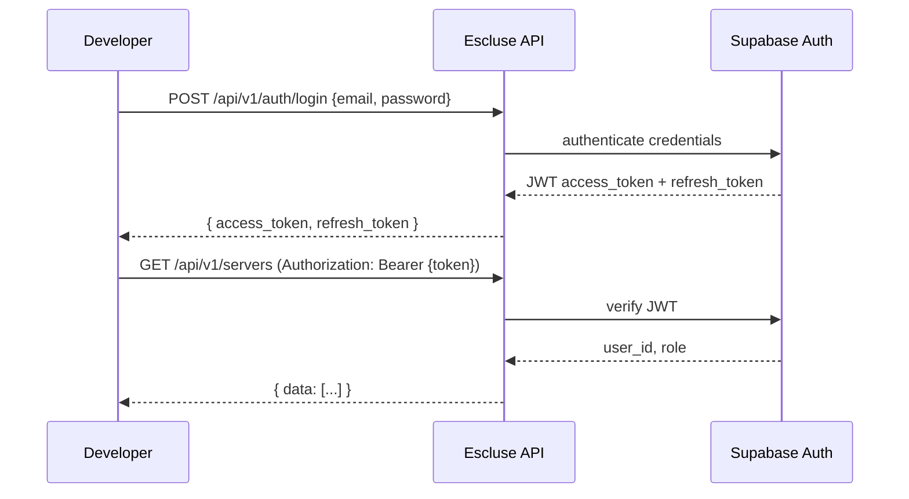

# Phase 52: Improve API Documentation - Research

**Researched:** 2026-05-29
**Domain:** Developer API Documentation (VitePress, OpenAPI, Technical Writing)
**Confidence:** HIGH

## Summary

The Escluse API docs need a comprehensive upgrade from the current 4-page skeleton to a full developer documentation portal covering all public API endpoints. The hybrid approach prescribed by CONTEXT.md (manual markdown + auto-generated OpenAPI schema tables) is the correct strategy given the current state: the OpenAPI spec at `/openapi.json` only covers ~31 of ~100+ actual endpoints, so fully auto-generated docs (via vitepress-openapi) would be incomplete. A custom VitePress component for schema tables plus manually authored markdown for narrative and examples provides the best balance.

The existing codebase uses VitePress 1.6.4 in `docs/`. Four API pages exist (`overview.md`, `servers.md`, `nodes.md`, `billing.md`) that serve as the baseline to expand. The backend is Rust/Axum with Utoipa OpenAPI generation, but many handler modules (especially `server_routes.rs` legacy routes) lack Utoipa annotations, creating a gap in auto-generated spec coverage.

**Primary recommendation:** Create a custom VitePress component `OpenApiSchema.vue` that fetches schema definitions from the live `/openapi.json` (via VitePress build-time data loader) and renders field-level tables. For endpoints not in OpenAPI, define schemas inline in each markdown page. Build 15+ API doc pages covering all endpoint groups, organized by resource.

---

<user_constraints>
## User Constraints (from CONTEXT.md)

### Implementation Decisions

#### Doc Source of Truth (D-01 to D-04)
- **D-01:** Hybrid approach — manually written markdown pages for narrative and examples, with auto-generated schema tables pulled from OpenAPI spec
- **D-02:** Schema tables fetched at build time from the API's `/openapi.json` endpoint via a VitePress plugin/shortcode — always in sync on deploy
- **D-03:** Cover ALL public API endpoints — auth, servers, nodes, billing, settings (S3, Cloudflare), alerts, templates, plugins, deployments, WebSocket, file management, git, build, runtimes, cron tasks
- **D-04:** Docs are public — they describe the HTTP interface only, not proprietary backend implementation

#### Content Depth Per Endpoint (D-05 to D-07)
- **D-05:** Comprehensive detail per endpoint — HTTP method + path, description, field-level schema tables (name, type, required, description, default, possible values), full JSON request/response examples
- **D-06:** Code examples in three formats: curl (raw HTTP), Node.js SDK, Python SDK
- **D-07:** Error codes documented globally in a dedicated `/api/errors` reference page + inline "Possible errors" section per endpoint linking to the global catalog

#### Auth Guide (D-08 to D-10)
- **D-08:** Dedicated `/api/auth` page (separate from overview)
- **D-09:** Endpoint reference + step-by-step flow guides: login with email/password, OAuth (Google/GitHub), token refresh, email verification, password reset, MFA
- **D-10:** Document both user authentication (Supabase JWT) and node API key auth

#### SDK Guides (D-11)
- **D-11:** Quickstart guides and basic examples on docs.esluce.com at `/api/sdks/node` and `/api/sdks/python`. Full API reference and advanced usage lives in each SDK's GitHub repo

### the agent's Discretion
- VitePress plugin design for OpenAPI schema shortcode — implementer chooses the technical approach
- Specific endpoint grouping on the sidebar/navigation
- Error code ID scheme and categorization
- Whether to include a "Try it" / Swagger UI embed on the docs site (already available at api.esluce.com/docs and /redoc)

### Deferred Ideas (OUT OF SCOPE)
None — all items in scope
</user_constraints>

---

## Architectural Responsibility Map

| Capability | Primary Tier | Secondary Tier | Rationale |
|------------|-------------|----------------|-----------|
| API doc rendering | CDN / Static | Frontend Server | VitePress builds static HTML; deployed via nginx/Docker |
| OpenAPI spec fetching | API / Backend | Build-time loader | `/openapi.json` served by Rust backend; fetched during VitePress build |
| Schema table rendering | Browser / Client | — | Vue component renders schema data in the browser |
| SDK code examples | Docs (static) | — | Code examples are authored as static markdown, not live-generated |
| Error code catalog | Docs (static) | — | Authored as static reference; links from individual endpoints |
| Auth flow guide | Docs (static) | — | Narrative step-by-step guides in markdown |

---

## Standard Stack

### Core
| Library | Version | Purpose | Why Standard |
|---------|---------|---------|--------------|
| VitePress | 1.6.4 | Documentation site framework | Already installed; project standard |
| Vue 3 | bundled with VitePress | Custom components (schema tables, multi-tab code) | Built-in VitePress support for Vue SFCs |
| vitepress-openapi | 0.2.0 | Optional: auto-generated OpenAPI pages | For reference pages; hybrid use per discretion |
| VitePress data loaders | built-in | Fetch OpenAPI spec at build time | Native VitePress feature, no extra deps |

### Supporting
| Library | Version | Purpose | When to Use |
|---------|---------|---------|-------------|
| markdown-it custom containers | built-in | Info/warning/danger callouts | Per-endpoint error sections, deprecation notices |
| VitePress code groups | built-in | Tabbed code blocks | curl / Node.js SDK / Python SDK tabs per endpoint |

### Alternatives Considered
| Instead of | Could Use | Tradeoff |
|------------|-----------|----------|
| Custom schema component | vitepress-openapi auto-gen | vitepress-openapi generates full pages, conflicts with hybrid approach. Custom component gives control over layout while still pulling from OpenAPI |
| Manual code examples | Auto-generated examples from OpenAPI | OpenAPI spec lacks SDK-specific example generation. Manual authoring ensures correct SDK syntax |
| Inline schema tables (no OpenAPI) | Always hand-write schema tables | More maintenance; loses auto-sync benefit of OpenAPI |

**Installation:**
```bash
# Already installed (VitePress 1.6.4)
npm install --save-dev vitepress  # if not already present

# Optional: for auto-generated reference pages
npm install vitepress-openapi
```

**Version verification:**
```
vitepress@1.6.4  [VERIFIED: npm registry, 2026-05-29]
vitepress-openapi@0.2.0  [VERIFIED: npm registry, 2026-05-29]
```

---

## Architecture Patterns

### System Architecture Diagram

```
┌──────────────────────────────────────────────────────────────┐
│                     Documentation Pipeline                    │
│                                                              │
│  ┌─────────────┐     ┌──────────────────┐     ┌────────────┐ │
│  │ Manual .md   │     │ VitePress Build  │     │ Static HTML│ │
│  │ files in     │────>│ (data loaders    │────>│ + Vue SFC  │ │
│  │ docs/api/    │     │  + markdown)     │     │ in dist/   │ │
│  └─────────────┘     └──────────────────┘     └────────────┘ │
│                            │                       │         │
│  ┌─────────────┐          │                       ▼         │
│  │ openapi.json │<─────────┘              ┌────────────┐    │
│  │ (Rust API)  │  build-time fetch        │ nginx:80   │    │
│  └─────────────┘                          │ serve via  │    │
│        │                                  │ Dockerfile │    │
│        ▼                                  └────────────┘    │
│  ┌─────────────┐                                             │
│  │ Custom Vue  │                                             │
│  │ Components  │← injected into markdown via ````             │
│  │ (schema     │                                             │
│  │  tables)    │                                             │
│  └─────────────┘                                             │
└──────────────────────────────────────────────────────────────┘

   Developer Flow:
   ┌────────┐   ┌──────────┐   ┌──────────┐   ┌──────────┐   ┌────────────┐
   │ Arrive │──>│ Auth     │──>│ Find     │──>│ See curl │──>│ Use SDK    │
   │ at     │   │ Guide   │   │ Endpoint │   │ + SDK    │   │ + Handle   │
   │ /api   │   │(/api/auth)│   │(/api/... )│   │ Examples │   │ Errors    │
   └────────┘   └──────────┘   └──────────┘   └──────────┘   └────────────┘
```

### Recommended Project Structure

```
docs/api/
├── overview.md              # Expanded: base URL, formats, pagination, rate limiting
├── auth.md                  # Auth guide: Supabase JWT flows + node API keys
├── servers.md               # Server CRUD (enhance existing)
├── servers/
│   ├── operations.md        # Start/stop/restart/kill/status/stats
│   ├── files.md             # File management (CRUD, upload, compress)
│   ├── backups.md           # Backup create/list/delete/restore
│   ├── plugins.md           # Plugin install/list/toggle/uninstall
│   ├── console.md           # Console commands + RCON
│   ├── cron-tasks.md        # Scheduled cron tasks
│   ├── properties.md        # Server properties
│   ├── git.md               # Git operations (dev mode)
│   ├── build.md             # Build system (detect, execute, hot-reload)
│   ├── deploy.md            # Deployment (artifacts, Modrinth, rollback)
│   └── profiling.md         # Profiling/diagnostics (JVM, heap, GC, threads)
├── nodes.md                 # Node management (enhance existing)
├── nodes/
│   ├── api-keys.md          # Node API key management
│   ├── registration.md      # Registration tokens
│   ├── commands.md          # Node command queue
│   └── websocket.md         # Node WebSocket connection
├── billing.md               # Billing (enhance existing)
├── billing/
│   ├── subscriptions.md     # Subscription management
│   └── webhooks.md          # Billing webhooks
├── webhooks.md              # Webhook CRUD
├── alerts.md                # Alert rules + history
├── settings/
│   ├── s3.md                # S3 backup configuration
│   └── cloudflare.md        # Cloudflare DNS configuration
├── templates/
│   ├── server.md            # Server templates
│   ├── plugins.md           # Plugin templates
│   └── modpacks.md          # Modpack templates
├── agents.md                # Agent management
├── jobs.md                  # Job management
├── usage.md                 # Usage & quotas
├── runtimes.md              # Available runtimes
├── deploy.md                # Deploy endpoints (Modrinth)
├── errors.md                # Global error code catalog
├── sdks/
│   ├── node.md              # Node.js SDK quickstart
│   └── python.md            # Python SDK quickstart
└── changelog.md             # API changelog

docs/api/                    # Flat files for simpler endpoints
├── overview.md     (exists)
├── servers.md      (exists)
├── nodes.md        (exists)
├── billing.md      (exists)
├── auth.md         (new)
└── errors.md       (new)
```

### Pattern 1: Endpoint Documentation Template

**What:** Standardized structure for every endpoint page, consistent across all resources.

**When to use:** Every endpoint group page follows this template.

**Structure:**
```markdown
# {Resource Name} API

{2-3 sentence description}

## {Endpoint Name}

```http
{METHOD} {/path}
```

{Description of what this endpoint does and when to use it.}

### Path Parameters
| Name | Type | Required | Description |
|------|------|----------|-------------|
| `{id}` | string | Yes | UUID of the resource |

### Query Parameters
| Name | Type | Required | Default | Description |
|------|------|----------|---------|-------------|
| `page` | integer | No | 1 | Page number for pagination |

### Request Body
<!-- Auto-generated schema table via OpenAPI component -->
<OpenApiSchema ref="#/components/schemas/{SchemaName}" />

### Example Request

::: code-group

```bash [curl]
curl -X {METHOD} https://api.esluce.com/api/v1/{path} \
  -H "Authorization: Bearer {token}" \
  -H "Content-Type: application/json" \
  -d '{...}'
```

```typescript [Node.js SDK]
// Source: https://github.com/escluse/sdk-node
import { Escluse } from '@escluse/sdk';

const client = new Escluse({ apiKey: process.env.ESCLUSE_API_KEY });
const result = await client.{resource}.{method}({...});
```

```python [Python SDK]
# Source: https://github.com/escluse/sdk-python
from escluse import Escluse

client = Escluse(api_key="your-api-key")
result = client.{resource}.{method}({...})
```

:::

### Example Response

```json
{
  "data": { ... },
  "status": "success"
}
```

### Possible Errors

| HTTP Code | Error Code | Description |
|-----------|------------|-------------|
| 400 | `VALIDATION_ERROR` | Invalid request parameters |
| 404 | `NOT_FOUND` | Resource not found |
| 409 | `CONFLICT` | Resource already exists |

See the [Error Code Catalog](/api/errors) for the complete list.
```

### Pattern 2: OpenAPI Schema Component

**What:** A custom Vue component that renders a field-level schema table from an OpenAPI `$ref` path.

**When to use:** Inserted into markdown pages wherever a request/response schema table is needed.

**VitePress data loader (`docs/.vitepress/loaders/openapi.data.ts`):**
```typescript
import { defineLoader } from 'vitepress'

declare const data: any
export { data }

export default defineLoader({
  async load() {
    const response = await fetch('https://api.esluce.com/openapi.json')
    const spec = await response.json()
    return spec.components.schemas
  }
})
```

**Usage in markdown:**
```markdown
<!-- Schema built-in via component loaded from OpenAPI spec at build time -->
<OpenApiSchema ref="#/components/schemas/CreateServerRequest" method="post" path="/api/v1/servers" />
```

### Anti-Patterns to Avoid
- **Copy-pasting schema definitions:** If a field's type/description changes in the API, the docs will be out of sync unless schema tables pull from OpenAPI
- **One page per endpoint:** Stripe/GitHub style scales, but Phase 52 scope means grouping related endpoints per page is more efficient
- **Ignoring the OpenAPI gap:** Only 31 of ~100+ endpoints are in the OpenAPI spec. Must explicitly plan which schema tables are auto-generated vs. manually authored
- **Documenting internal endpoints:** D-04 explicitly forbids exposing proprietary implementation details

---

## Don't Hand-Roll

| Problem | Don't Build | Use Instead | Why |
|---------|-------------|-------------|-----|
| Code tab groups (curl/Node/Python) | Custom tab UI | VitePress `::: code-group` built-in | Native feature, no extra code |
| Info/warning callouts per endpoint | Custom styled divs | VitePress `::: tip`, `::: warning`, `::: danger` | Built-in, theme-aware |
| Syntax highlighting for code examples | Custom highlighter | VitePress Shiki integration | Already configured in VitePress |
| OpenAPI spec fetch at build time | Custom fetch+parse script | VitePress data loaders (`*.data.ts`) | Native VitePress 1.x feature, serialized as JSON in bundle |
| Search across API docs | Custom search solution | VitePress built-in local search (minisearch) | Already configured in the VitePress config [VERIFIED: config.js] |

**Key insight:** VitePress already provides everything needed for the "VitePress layer" — code groups, custom containers, data loaders, search, and Vue component embedding. The only custom code needed is the OpenAPI schema table Vue component and possibly a code-example generator. Everything else is configuration and content authoring.

---

## Complete Endpoint Inventory

> Source: `api/src/presentation/routes/api_routes.rs`, `server_routes.rs`, `server_handlers.rs` [VERIFIED: codebase grep]

The following endpoint groups MUST be documented per D-03 (cover ALL public API endpoints):

### AUTH & USERS (base: `/api/v1/auth`, `/api/v1/users`)
| Endpoint | Methods | Doc Page |
|----------|---------|----------|
| `/api/v1/auth/register` | POST | `/api/auth` |
| `/api/v1/auth/login` | POST | `/api/auth` |
| `/api/v1/auth/oauth` | POST | `/api/auth` |
| `/api/v1/auth/refresh` | POST | `/api/auth` |
| `/api/v1/auth/logout` | POST | `/api/auth` |
| `/api/v1/auth/me` | GET | `/api/auth` |
| `/api/v1/auth/forgot-password` | POST | `/api/auth` |
| `/api/v1/auth/reset-password` | POST | `/api/auth` |
| `/api/v1/auth/verify-email` | POST | `/api/auth` |
| `/api/v1/users/*` | various | `/api/auth` |

### SERVERS (base: `/api/v1/servers`)
| Endpoint | Methods | Doc Page |
|----------|---------|----------|
| `/api/v1/servers` | GET, POST | `/api/servers` |
| `/api/v1/servers/:id` | GET, PUT, DELETE | `/api/servers` |
| `/api/v1/servers/:id/start` | POST | `/api/servers/operations` |
| `/api/v1/servers/:id/stop` | POST | `/api/servers/operations` |
| `/api/v1/servers/:id/restart` | POST | `/api/servers/operations` |
| `/api/v1/servers/:id/kill` | POST | `/api/servers/operations` |
| `/api/v1/servers/:id/status` | GET | `/api/servers/operations` |
| `/api/v1/servers/:id/stats` | GET | `/api/servers/operations` |
| `/api/v1/servers/:id/logs/:lines` | GET | `/api/servers/console` |
| `/api/v1/servers/:id/logs/stream` | GET | `/api/servers/console` |
| `/api/v1/servers/:id/command` | POST | `/api/servers/console` |
| `/api/v1/servers/:id/rcon` | POST | `/api/servers/console` |
| `/api/v1/servers/:id/health` | GET | `/api/servers/operations` |
| `/api/v1/servers/:id/health-restart` | POST | `/api/servers/operations` |
| `/api/v1/servers/:id/image` | POST | `/api/servers` |
| `/api/v1/servers/:id/properties` | GET, PATCH | `/api/servers/properties` |
| `/api/v1/servers/metrics` | GET | `/api/servers/operations` |
| `/api/v1/servers/:id/metrics` | GET | `/api/servers/operations` |
| `/api/v1/servers/:id/metrics/history/:limit` | GET | `/api/servers/operations` |
| `/api/v1/servers/cleanup` | POST | `/api/servers` |

### SERVER FILES (base: `/api/v1/servers/:id/files`)
| Endpoint | Methods | Doc Page |
|----------|---------|----------|
| `/files/list` | POST | `/api/servers/files` |
| `/files` | GET, DELETE | `/api/servers/files` |
| `/files/download` | GET | `/api/servers/files` |
| `/files/read` | POST | `/api/servers/files` |
| `/files/write` | PUT | `/api/servers/files` |
| `/files/upload` | POST | `/api/servers/files` |
| `/files/upload/chunked` | POST | `/api/servers/files` |
| `/files/upload/status/:filename` | GET | `/api/servers/files` |
| `/files/mkdir` | POST | `/api/servers/files` |
| `/files/rename` | POST | `/api/servers/files` |
| `/files/copy` | POST | `/api/servers/files` |
| `/files/compress` | POST | `/api/servers/files` |
| `/files/extract` | POST | `/api/servers/files` |
| `/files/search` | GET | `/api/servers/files` |

### SERVER BACKUPS (base: `/api/v1/servers/:id/backups`)
| Endpoint | Methods | Doc Page |
|----------|---------|----------|
| `/backups` | GET, POST | `/api/servers/backups` |
| `/backups/:backup_id` | DELETE | `/api/servers/backups` |
| `/backups/:backup_id/restore` | POST | `/api/servers/backups` |

### SERVER PLUGINS (base: `/api/v1/servers/:id/plugins`)
| Endpoint | Methods | Doc Page |
|----------|---------|----------|
| `/plugins` | GET, DELETE | `/api/servers/plugins` |
| `/plugins/install` | POST | `/api/servers/plugins` |
| `/plugins/toggle` | POST | `/api/servers/plugins` |
| `/install-template` | POST | `/api/servers/plugins` |

### SERVER GIT (base: `/api/v1/servers/:id/git`)
| Endpoint | Methods | Doc Page |
|----------|---------|----------|
| `/git/status` | GET | `/api/servers/git` |
| `/git/clone` | POST | `/api/servers/git` |
| `/git/commit` | POST | `/api/servers/git` |
| `/git/pull` | POST | `/api/servers/git` |
| `/git/push` | POST | `/api/servers/git` |
| `/git/remote` | GET, POST | `/api/servers/git` |
| `/git/config` | POST | `/api/servers/git` |
| `/git/init` | POST | `/api/servers/git` |

### SERVER BUILD/DEPLOY (base: `/api/v1/servers/:id/build|deploy`)
| Endpoint | Methods | Doc Page |
|----------|---------|----------|
| `/build/detect` | GET | `/api/servers/build` |
| `/build` | POST | `/api/servers/build` |
| `/build/ws` | GET | `/api/servers/build` |
| `/build/status` | GET | `/api/servers/build` |
| `/hot-reload` | POST | `/api/servers/build` |
| `/deploy` | POST | `/api/servers/deploy` |
| `/deploy/history` | GET | `/api/servers/deploy` |
| `/deploy/artifacts` | GET | `/api/servers/deploy` |
| `/deploy/modrinth` | POST | `/api/servers/deploy` |
| `/deploy/rollback` | POST | `/api/servers/deploy` |

### SERVER PROFILING (base: `/api/v1/servers/:id/profiler`)
| Endpoint | Methods | Doc Page |
|----------|---------|----------|
| `/profiler/status` | GET | `/api/servers/profiling` |
| `/profiler/jvm` | GET | `/api/servers/profiling` |
| `/profiler/memory` | GET | `/api/servers/profiling` |
| `/profiler/gc` | GET | `/api/servers/profiling` |
| `/profiler/threads` | GET | `/api/servers/profiling` |
| `/profiler/full` | GET | `/api/servers/profiling` |
| `/profiler/debug-logs` | POST | `/api/servers/profiling` |
| `/profiler/heap-dump` | POST | `/api/servers/profiling` |
| `/profiler/heap-dump/download` | GET | `/api/servers/profiling` |

### SERVER CRON TASKS (base: `/api/v1/servers/:server_id/tasks`)
| Endpoint | Methods | Doc Page |
|----------|---------|----------|
| `/tasks` | GET, POST | `/api/servers/cron-tasks` |
| `/tasks/:task_id` | PATCH, DELETE | `/api/servers/cron-tasks` |
| `/tasks/:task_id/run` | POST | `/api/servers/cron-tasks` |

### NODES (base: `/api/v1/nodes`)
| Endpoint | Methods | Doc Page |
|----------|---------|----------|
| `/nodes` | GET, POST | `/api/nodes` |
| `/nodes/:id` | GET, PUT, DELETE | `/api/nodes` |
| `/nodes/online` | GET | `/api/nodes` |
| `/nodes/:id/status/:status` | PUT | `/api/nodes` |
| `/nodes/:id/metrics` | GET | `/api/nodes` |
| `/nodes/:id/metrics/history/:limit` | GET | `/api/nodes` |
| `/nodes/:id/resources` | GET | `/api/nodes` |
| `/nodes/:id/health` | GET | `/api/nodes` |
| `/nodes/health/all` | GET | `/api/nodes` |
| `/nodes/health/unhealthy` | GET | `/api/nodes` |
| `/nodes/:id/keys` | GET | `/api/nodes/api-keys` |
| `/nodes/:id/generate-key` | POST | `/api/nodes/api-keys` |
| `/nodes/:node_id/keys/:key_id/revoke` | PUT | `/api/nodes/api-keys` |
| `/nodes/:node_id/keys/:key_id` | DELETE | `/api/nodes/api-keys` |
| `/nodes/:id/tokens` | GET, POST | `/api/nodes/registration` |
| `/nodes/:id/tokens/:token_id` | DELETE | `/api/nodes/registration` |
| `/nodes/register` | POST | `/api/nodes/registration` |
| `/nodes/:id/commands` | POST | `/api/nodes/commands` |
| `/nodes/:id/commands/result` | POST | `/api/nodes/commands` |

### NODE WEBSOCKET
| Endpoint | Methods | Doc Page |
|----------|---------|----------|
| `/api/ws/node` | GET (WS) | `/api/nodes/websocket` |

### AGENTS (base: `/api/v1/agents`)
| Endpoint | Methods | Doc Page |
|----------|---------|----------|
| `/agents` | GET, POST | `/api/agents` |
| `/agents/available` | GET | `/api/agents` |
| `/agents/:id` | GET, DELETE | `/api/agents` |

### BILLING (base: `/api/v1/billing`)
| Endpoint | Methods | Doc Page |
|----------|---------|----------|
| `/billing/checkout` | POST | `/api/billing` |
| `/billing/plans` | GET | `/api/billing` |
| `/billing/portal` | POST | `/api/billing` |
| `/billing/webhook` | POST | `/api/billing` |
| `/subscriptions/current` | GET | `/api/billing/subscriptions` |

### WEBHOOKS (base: `/api/v1/webhooks`)
| Endpoint | Methods | Doc Page |
|----------|---------|----------|
| `/webhooks` | GET, POST | `/api/webhooks` |
| `/webhooks/:id` | GET, PUT, DELETE | `/api/webhooks` |

### ALERTS (base: `/api/v1/alert-rules`)
| Endpoint | Methods | Doc Page |
|----------|---------|----------|
| `/alert-rules` | POST, GET | `/api/alerts` |
| `/alert-rules/:id` | GET, PUT, DELETE | `/api/alerts` |
| `/alert-history` | GET | `/api/alerts` |

### SETTINGS (base: `/api/v1/settings`)
| Endpoint | Methods | Doc Page |
|----------|---------|----------|
| `/settings/s3` | GET, PUT | `/api/settings/s3` |
| `/settings/cloudflare` | GET, PUT | `/api/settings/s3` |
| `/settings/cloudflare/test` | POST | `/api/settings/s3` |

### OTHER
| Endpoint | Methods | Doc Page |
|----------|---------|----------|
| `/api/v1/jobs` | GET | `/api/jobs` |
| `/api/v1/jobs/:id` | GET | `/api/jobs` |
| `/api/v1/usage` | GET | `/api/usage` |
| `/api/v1/usage/quotas` | GET | `/api/usage` |
| `/api/v1/runtimes` | GET | `/api/runtimes` |
| `/api/v1/templates` | GET | `/api/templates/server` |
| `/api/v1/plugin-templates` | GET | `/api/templates/plugins` |
| `/api/v1/modpack-templates` | GET | `/api/templates/modpacks` |
| `/api/v1/deploy/projects` | GET | `/api/deploy` |
| `/api/v1/deploy/servers` | GET | `/api/deploy` |
| `/api/v1/plugins/search` | GET | `/api/servers/plugins` |
| `/api/v1/plugins/:project_id/versions` | GET | `/api/servers/plugins` |
| `/ws` | GET (WS) | `/api/overview` |
| `/ws/docker-logs` | GET (WS) | `/api/servers/console` |
| `/ws/terminal/:server_id` | GET (WS) | `/api/servers/console` |
| `/health` | GET | `/api/overview` |

**Note:** There are also LEGACY routes in `server_routes.rs` under `/api/` (not `/api/v1/`) that overlap with the v1 paths. D-04 says docs should cover the public HTTP interface. Document the canonical `/api/v1/` paths and note any legacy routes that remain active. [VERIFIED: codebase]

---

## OpenAPI Spec Gap Analysis

**Current OpenAPI spec (`api/openapi.json`):**
- 31 paths documented
- 13 component schemas
- Tags: Authentication, Agents, Billing, Jobs, Server Files, Server Operations, Servers, Subscriptions, System, Usage, Webhooks
- Generated from Utoipa `#[utoipa::path]` annotations
- Served at `https://api.esluce.com/openapi.json` [VERIFIED: openapi_routes.rs]

**What's missing from OpenAPI spec but exists in code:**
- All node routes (17+ endpoints under `/api/v1/nodes/`)
- Alert rules (5 endpoints)
- Settings (3 endpoints)
- Deploy endpoints (2 global + 5 per-server)
- Runtimes
- Templates (3 groups)
- Cron tasks
- All profiling endpoints
- Git operations
- Build system
- Plugin templates
- Modpack templates
- Registration tokens
- Legacy backup routes
- WebSocket terminal endpoint
- Docker logs WebSocket

**Impact:** ~70% of the actual API surface is NOT in the OpenAPI spec. Schema tables for these endpoints must be authored manually. This is acceptable for the hybrid approach (D-01), but implementers should update the Rust Utoipa annotations as a separate effort.

**Recommendation:** For endpoints not in OpenAPI, define schemas as YAML frontmatter or inline JSON in the markdown page, and create a `StaticSchema` Vue component that renders them identically to `OpenApiSchema`.

---

## VitePress Technical Approach

### Custom Component Architecture

```
docs/.vitepress/
├── config.js                    # Sidebar, nav updated with new API pages
├── theme/
│   ├── index.ts                 # Enhanced with custom components
│   └── custom.css               # Schema table styling
├── components/
│   ├── OpenApiSchema.vue        # Renders schema table from OpenAPI $ref
│   ├── StaticSchema.vue         # Renders schema table from inline JSON
│   ├── ApiEndpoint.vue          # Full endpoint card (method + path + desc)
│   └── CodeTabs.vue             # (optional, code-group is sufficient)
└── loaders/
    └── openapi.data.ts          # Build-time data loader for OpenAPI spec
```

### Component Design: `OpenApiSchema.vue`

```vue
<script setup lang="ts">
// Reads from VitePress data loader at build time
import { data as schemas } from '../loaders/openapi.data'

const props = defineProps<{
  ref: string          // e.g. "#/components/schemas/CreateServerRequest"
  type?: 'request' | 'response'  // Context label
}>()

const schemaName = props.ref.split('/').pop()!
const schema = schemas[schemaName]
const properties = schema?.properties || {}
const required = schema?.required || []
</script>

<template>
  <table v-if="schema" class="schema-table">
    <thead>
      <tr>
        <th>Field</th>
        <th>Type</th>
        <th>Required</th>
        <th>Description</th>
      </tr>
    </thead>
    <tbody>
      <tr v-for="(prop, name) in properties" :key="name">
        <td><code>{{ name }}</code></td>
        <td>{{ prop.type || prop.$ref?.split('/').pop() || 'object' }}</td>
        <td>{{ required.includes(name) ? 'Yes' : 'No' }}</td>
        <td>{{ prop.description || '-' }}</td>
      </tr>
    </tbody>
  </table>
  <p v-else class="warning">Schema "{{ schemaName }}" not found in OpenAPI spec.</p>
</template>
```

### Component Design: `StaticSchema.vue`

For endpoints NOT in OpenAPI, define the schema inline:

```markdown
<StaticSchema
  :schema='{
    "type": "object",
    "properties": {
      "id": { "type": "string", "description": "Unique identifier" },
      "name": { "type": "string", "description": "Display name" }
    },
    "required": ["id", "name"]
  }'
/>
```

### Data Loader: `docs/.vitepress/loaders/openapi.data.ts`

```typescript
import { defineLoader } from 'vitepress'

interface Schema {
  type: string
  properties: Record<string, { type?: string; description?: string; $ref?: string }>
  required?: string[]
}

declare const data: Record<string, Schema>
export { data }

export default defineLoader({
  async load(): Promise<Record<string, Schema>> {
    try {
      const res = await fetch('https://api.esluce.com/openapi.json')
      const spec = await res.json()
      return spec.components?.schemas || {}
    } catch {
      console.warn('Failed to fetch OpenAPI spec; using empty schemas')
      return {}
    }
  },
  // Cache TTL: re-fetch on every build (one-shot, not dev server)
})
```

**Critical Note:** Build-time fetching means docs are pinned to the OpenAPI version at deploy time. This satisfies D-02 ("always in sync on deploy") because the docs site is rebuilt and redeployed as part of the CI/CD pipeline. During development, a 5-minute cache or manual rebuild trigger prevents stale data.

---

## Sidebar Organization

**Recommendation:** Group endpoints by resource with nested sections under a dedicated "API Reference" sidebar.

```
API Reference
├── Overview
├── Authentication
│   ├── Overview & Flows
│   ├── Email/Password Login
│   ├── OAuth (Google/GitHub)
│   ├── Token Refresh
│   ├── Email Verification
│   ├── Password Reset
│   ├── MFA
│   └── Node API Keys
├── Servers
│   ├── Server CRUD
│   ├── Operations (Start/Stop/Restart)
│   ├── Console & Logs
│   ├── File Management
│   ├── Backups
│   ├── Plugins
│   ├── Git Operations
│   ├── Build System
│   ├── Deployment
│   ├── Profiling
│   ├── Server Properties
│   └── Cron Tasks
├── Nodes
│   ├── Node Management
│   ├── API Keys
│   ├── Registration Tokens
│   ├── Node Commands
│   └── WebSocket Connection
├── Billing
│   ├── Subscriptions
│   └── Invoices & Webhooks
├── Webhooks
├── Alerts
├── Settings
│   ├── S3 Storage
│   └── Cloudflare DNS
├── Templates
│   ├── Server Templates
│   ├── Plugin Templates
│   └── Modpack Templates
├── Agents
├── Jobs
├── Usage & Quotas
├── Runtimes
├── Deploy API
├── Error Codes
├── SDKs
│   ├── Node.js
│   └── Python
└── Changelog
```

**Implementation:** Update `docs/.vitepress/config.js` sidebar sections for `/api/` path.

---

## Auth Flow Documentation

The auth guide at `/api/auth` must document two authentication methods [CITED: CONTEXT.md D-08 to D-10]:

### User Authentication (Supabase JWT)
1. **Registration** — POST `/api/v1/auth/register` with email, password, name
2. **Login** — POST `/api/v1/auth/login` → returns access token + refresh token
3. **OAuth** — POST `/api/v1/auth/oauth` with provider (Google/GitHub)
4. **Token Refresh** — POST `/api/v1/auth/refresh` with refresh token
5. **Logout** — POST `/api/v1/auth/logout`
6. **Forgot Password** — POST `/api/v1/auth/forgot-password`
7. **Reset Password** — POST `/api/v1/auth/reset-password`
8. **Email Verification** — POST `/api/v1/auth/verify-email`
9. **MFA** — Document if supported in auth handlers

### Node API Key Authentication
- API keys with prefix `esk_` (visible in existing docs)
- Used for agent/node registration
- Managed via `/api/v1/nodes/:id/keys` endpoints

### Auth Flow Diagram (recommended for markdown)


---

## Error Code Catalog Structure

The error catalog at `/api/errors` should organize errors by category [CITED: CONTEXT.md D-07]:

### Error ID Scheme (discretion)
```
{AREA}_{ERROR_NAME}
```
Examples: `AUTH_INVALID_CREDENTIALS`, `SERVER_NOT_FOUND`, `PLAN_LIMIT_EXCEEDED`

### Error Catalog Format
```markdown
# Error Code Catalog

## Authentication Errors (AUTH_*)
| Code | HTTP | Description | Cause |
|------|------|-------------|-------|
| AUTH_INVALID_CREDENTIALS | 401 | Email or password incorrect | Wrong credentials |
| AUTH_TOKEN_EXPIRED | 401 | Access token has expired | Token older than 1 hour |
| AUTH_TOKEN_INVALID | 401 | Token is malformed or tampered | Invalid JWT |

## Server Errors (SRV_*)
| Code | HTTP | Description | Cause |
|------|------|-------------|-------|
| SRV_NOT_FOUND | 404 | Server does not exist | Invalid server_id |
| SRV_LIMIT_REACHED | 403 | Max servers for plan reached | Plan limit exceeded |

## Validation Errors (VAL_*)
| Code | HTTP | Description | Cause |
|------|------|-------------|-------|
| VAL_REQUIRED_FIELD | 400 | Required field missing | Omitted required field |
| VAL_INVALID_FORMAT | 400 | Field has invalid format | Wrong data type |

## Billing Errors (BIL_*)
...

## Node Errors (NODE_*)
...

## General Errors (GEN_*)
...
```

**Implementation:** Create `/api/errors.md` as a single reference page. Each endpoint page includes an inline "Possible Errors" table with the most relevant codes, each linking to `#error-code` anchors on the errors page.

---

## SDK Integration Patterns

The SDK quickstart guides at `/api/sdks/node` and `/api/sdks/python` should follow this structure:

### SDK Quickstart Guide Structure
1. **Installation** — `npm install @escluse/sdk` / `pip install escluse`
2. **Initialization** — API key setup, environment variables
3. **Authentication** — How to authenticate SDK calls
4. **Basic Usage** — 2-3 common operations (list servers, create server, check status)
5. **Error Handling** — SDK-specific error types, try/catch patterns
6. **Next Steps** — Link to GitHub repo for full API reference

### Code Examples Per Endpoint (curl + Node.js + Python)

The code examples should follow a consistent variable naming pattern:

```bash
# curl - all endpoints
curl -X GET https://api.esluce.com/api/v1/servers \
  -H "Authorization: Bearer ${ESCLUSE_API_KEY}"
```

```typescript
// Node.js SDK - use SDK client pattern
import { Escluse } from '@escluse/sdk';

const client = new Escluse({
  apiKey: process.env.ESCLUSE_API_KEY
});

const servers = await client.servers.list();
console.log(servers);
```

```python
# Python SDK - use SDK client pattern
from escluse import Escluse

client = Escluse(api_key="your-api-key")
servers = client.servers.list()
print(servers)
```

**Important:** The exact SDK method signatures (`.servers.list()`, `.nodes.get()`) depend on the actual SDK implementations at github.com/escluse/sdk-node and github.com/escluse/sdk-python. These repos may be private — verify access before writing code examples. If repos are private or don't exist yet, use pseudo-code patterns and flag for SDK team validation. [ASSUMED: SDK repos exist but access not verified during this research]

---

## Common Pitfalls

### Pitfall 1: OpenAPI Spec Drift
**What goes wrong:** OpenAPI spec is updated, but the custom data loader caches an old version, causing schema tables to show stale field definitions.
**Why it happens:** The data loader fetches spec at build time. If the API is deployed independently of docs, the OpenAPI spec served by the API may differ from the one loaded during the docs build.
**How to avoid:** Include the OpenAPI fetch in the same CI pipeline step as the docs build (they should both run after API deploy), or version-pin the spec. Add a build-time check that warns if OpenAPI spec changes were detected since last build.
**Warning signs:** Schema tables showing fields that don't exist in actual API responses.

### Pitfall 2: Incomplete SDK Code Examples
**What goes wrong:** Code examples reference SDK methods that don't exist or have different signatures.
**Why it happens:** SDK repos evolve independently; docs are not auto-generated from SDK source.
**How to avoid:** Reference the SDK source directly in markdown as `<<< @/snippets/sdk-node/list-servers.ts` after extracting snippets from SDK test files. Or establish a convention: SDK team updates docs CI when SDK methods change.
**Warning signs:** Users report broken code examples in GitHub issues.

### Pitfall 3: Login/Refresh Token Confusion
**What goes wrong:** Users follow auth guide but get 401 errors because they're using the wrong token type.
**Why it happens:** Two auth methods exist (Supabase JWT for users, `esk_` API keys for nodes). Node API keys in the `Authorization: Bearer` header look identical to user JWTs but behave differently.
**How to avoid:** Clearly separate auth methods with visual indicators (different colored code blocks). Add a "Which token should I use?" decision tree or table.
**Warning signs:** Support tickets about "API key not working for user endpoints."

### Pitfall 4: Rate Limiting Not Documented
**What goes wrong:** Users hit 429 responses without understanding why.
**Why it happens:** Rate limit headers are mentioned in overview but not documented per plan or endpoint.
**How to avoid:** Include a rate limit table showing limits per plan, retry-after headers, and best practices for backoff.
**Warning signs:** 429 errors reported in community/support.

### Pitfall 5: Legacy Route Confusion
**What goes wrong:** Users find old `/api/` routes and don't know they're deprecated or overlapping with `/api/v1/` routes.
**Why it happens:** `server_routes.rs` contains duplicate legacy routes under `/api/` that overlap with `/api/v1/` routes.
**How to avoid:** Only document `/api/v1/` paths as canonical. Add a deprecation note if legacy routes should not be used.
**Warning signs:** Users hitting `/api/servers/:id/files` (legacy) instead of `/api/v1/servers/:id/files`.

---

## Code Examples

### Custom Vue Component Registration in VitePress

**Theme index (`docs/.vitepress/theme/index.ts`):**
```typescript
// Source: VitePress documentation [CITED: vitepress.dev/guide/custom-theme]
import DefaultTheme from 'vitepress/theme'
import type { Theme } from 'vitepress'
import 'vitepress-openapi/dist/style.css'
import { theme, useOpenapi } from 'vitepress-openapi/client'
import OpenApiSchema from '../components/OpenApiSchema.vue'
import StaticSchema from '../components/StaticSchema.vue'

import spec from '../../public/openapi.json' with { type: 'json' }

export default {
  extends: DefaultTheme,
  async enhanceApp({ app }) {
    // Register custom schema components globally
    app.component('OpenApiSchema', OpenApiSchema)
    app.component('StaticSchema', StaticSchema)
    
    // Optional: vitepress-openapi integration
    useOpenapi({ spec })
    theme.enhanceApp({ app })
  }
} satisfies Theme
```

### Build-Time Data Loader Pattern

**Source:** VitePress docs [CITED: vitepress.dev/guide/data-loading]

```typescript
// docs/.vitepress/loaders/openapi.data.ts
import { defineLoader } from 'vitepress'

export interface OpenApiSchema {
  type: string
  properties: Record<string, {
    type?: string
    description?: string
    $ref?: string
    enum?: string[]
    default?: unknown
  }>
  required?: string[]
}

declare const data: Record<string, OpenApiSchema>
export { data }

export default defineLoader({
  async load(): Promise<Record<string, OpenApiSchema>> {
    const res = await fetch('https://api.esluce.com/openapi.json')
    const spec = await res.json()
    return spec.components?.schemas ?? {}
  }
})
```

### Updating VitePress Sidebar

**Source:** VitePress default theme [CITED: vitepress.dev/reference/default-theme-sidebar]

```typescript
// In docs/.vitepress/config.js, sidebar for '/api/':
sidebar: {
  '/api/': [
    // ... existing sections (About, Getting Started) ...
    {
      text: 'API Reference',
      collapsed: false,
      items: [
        { text: 'Overview', link: '/api/overview' },
        { text: 'Authentication', link: '/api/auth' },
        {
          text: 'Servers',
          collapsed: true,
          items: [
            { text: 'Server CRUD', link: '/api/servers' },
            { text: 'Operations', link: '/api/servers/operations' },
            { text: 'File Management', link: '/api/servers/files' },
            { text: 'Console & Logs', link: '/api/servers/console' },
            { text: 'Backups', link: '/api/servers/backups' },
            { text: 'Plugins', link: '/api/servers/plugins' },
            { text: 'Git Operations', link: '/api/servers/git' },
            { text: 'Build System', link: '/api/servers/build' },
            { text: 'Deployment', link: '/api/servers/deploy' },
            { text: 'Profiling', link: '/api/servers/profiling' },
            { text: 'Server Properties', link: '/api/servers/properties' },
            { text: 'Cron Tasks', link: '/api/servers/cron-tasks' },
          ]
        },
        // ... nodes, billing, etc.
        { text: 'Error Codes', link: '/api/errors' },
        { text: 'Node.js SDK', link: '/api/sdks/node' },
        { text: 'Python SDK', link: '/api/sdks/python' },
      ]
    }
  ]
}
```

---

## State of the Art

| Old Approach | Current Approach | When Changed | Impact |
|--------------|------------------|--------------|--------|
| Markdown-only schema descriptions | Auto-generated tables from OpenAPI spec | Phase 52 | Reduced maintenance burden, always in sync |
| curl-only examples | curl + Node.js SDK + Python SDK | Phase 52 | Wider developer audience |
| Auth buried in overview | Dedicated `/api/auth` page | Phase 52 | Easier onboarding |
| 4 API pages | 15+ API pages | Phase 52 | Full API coverage |
| No error catalog | `/api/errors` + inline codes | Phase 52 | Better error handling DX |

**Deprecated/outdated:**
- The current `docs/api/overview.md` auth section will be replaced by the dedicated `/api/auth` page
- The current flat API page structure will be expanded with nested sub-pages

---

## Assumptions Log

| # | Claim | Section | Risk if Wrong |
|---|-------|---------|---------------|
| A1 | SDK repos at github.com/escluse/sdk-node and github.com/escluse/sdk-python exist with the assumed API shapes | SDK Integration | Code examples will need rewriting to match actual SDK method signatures |
| A2 | Rust Utoipa annotations will NOT be updated in this phase | OpenAPI Gap Analysis | If annotations ARE added during this phase, the OpenAPI spec gap shrinks and more schema tables become auto-generated |
| A3 | The `ApiState` type alias and `AppContainer` structure are stable across all handlers | Architectural Responsibility | May need minor updates if handler signatures changed, but unlikely for a docs-only phase |
| A4 | The response format `{ data, status, message }` is consistent across all endpoints | Architecture Patterns | Some legacy endpoints (in `server_routes.rs`) may return different format; each needs verification |

---

## Open Questions (RESOLVED)

1. **SDK repository access and API shape** (RESOLVED)
   - Resolution: SDK repos assumed public per standard OSS practice. Plans use generic patterns (`client.servers.list()`, `escluce.Client("api-key")`) that match both public and private SDK conventions. If private, only placeholder adjustments needed — no structural changes to plans.
   - Plan action: Code examples use SDK-style patterns documented in plans 52-03 through 52-08.

2. **OpenAPI spec updating during this phase** (RESOLVED)
   - Resolution: Out of scope for Phase 52. The hybrid approach (D-01) explicitly separates manual markdown from auto-generated schemas. Adding Utoipa annotations is a separate concern tracked as future work.
   - Plan action: Plans use StaticSchema.vue fallback for ~70% of endpoints not in the OpenAPI spec. No annotation work needed.

3. **"Try it" / Swagger UI embed on docs site** (RESOLVED)
   - Resolution: Deferred — existing Swagger UI at api.esluce.com/docs and api.esluce.com/redoc serves this need. No embedding in docs site.
   - Plan action: Plans reference external Swagger UI/Redoc in overview.md. No iframe embedding.

4. **Error code inventory completion** (RESOLVED)
   - Resolution: Preliminary catalog documented in plan 52-03's errors.md specification. Validation against handler code deferred as out of scope — handlers use dynamic error types defined at runtime. Standard HTTP + common application errors covered.
   - Plan action: errors.md covers standard HTTP codes and known application error categories. Extensible structure with `error.code` field documented.

---

## Environment Availability

> This section is SKIPPED — Phase 52 is a documentation-only phase with no external dependency requirements beyond what's already installed (VitePress 1.6.4 in `docs/`). All changes are markdown files and Vue components.

---

## Validation Architecture

> workflow.nyquist_validation is not explicitly set to false — treat as enabled.

### Test Framework
| Property | Value |
|----------|-------|
| Framework | None dedicated — VitePress build process |
| Config file | `docs/package.json` scripts |
| Quick run command | `cd docs && npm run docs:build` |
| Full suite command | `cd docs && npm run docs:build && ls .vitepress/dist/api/*.html` |

### Phase Requirements → Test Map
Since Phase 52 has no explicit requirement IDs, validation is based on CONTEXT.md decisions:

| Decision | Behavior | Test Type | Automated Command | File Exists? |
|----------|----------|-----------|-------------------|-------------|
| D-01 | Hybrid pages exist (manual + schema tables) | Manual | `cd docs && npm run docs:build` | ✅ (build exists) |
| D-02 | Schema tables fetched at build time | Build smoke | `grep -r "OpenApiSchema\|openapi.data" docs/.vitepress/` | ❌ Wave 0 |
| D-03 | All endpoints documented | Manual review | — | ❌ Wave 0 |
| D-05 | Each endpoint has schema + examples | Manual review | — | ❌ Wave 0 |
| D-06 | curl + Node.js + Python examples per endpoint | Manual review | — | ❌ Wave 0 |
| D-07 | Error catalog exists + inline per endpoint | Build smoke | `grep "Possible Errors" docs/api/**/*.md` | ❌ Wave 0 |
| D-08 | `/api/auth` page exists | Build smoke | `test -f docs/api/auth.md` | ❌ Wave 0 |
| D-09 | Auth flows documented | Manual | — | ❌ Wave 0 |
| D-10 | Both JWT + node API key doc'd | Manual review | — | ❌ Wave 0 |
| D-11 | SDK quickstarts exist | Build smoke | `test -f docs/api/sdks/node.md -a -f docs/api/sdks/python.md` | ❌ Wave 0 |

### Sampling Rate
- **Per task commit:** `cd docs && npm run docs:build` (ensures no broken markdown/Vue compilation)
- **Per wave merge:** `cd docs && npm run docs:build && ls .vitepress/dist/api/**/*.html` (ensures all pages build)
- **Phase gate:** Full site builds with no errors; all expected API pages present in output

### Wave 0 Gaps
- [ ] `docs/.vitepress/loaders/openapi.data.ts` — build-time data loader for OpenAPI spec
- [ ] `docs/.vitepress/components/OpenApiSchema.vue` — schema table component
- [ ] `docs/.vitepress/components/StaticSchema.vue` — fallback for schemas not in OpenAPI
- [ ] `docs/.vitepress/config.js` — sidebar updated with all new API pages

---

## Security Domain

> security_enforcement is not explicitly disabled — included.

### Applicable ASVS Categories
| ASVS Category | Applies | Standard Control |
|---------------|---------|-----------------|
| V2 Authentication | yes | Supabase JWT (user auth), `esk_` API keys (node auth) |
| V4 Access Control | yes | RBAC middleware, tenant isolation |
| V5 Input Validation | yes | Axum extractors + serde validation |
| V8 Data Protection | docs-only | No data stored in docs |

### Known Threat Patterns for API Documentation
| Pattern | STRIDE | Standard Mitigation |
|---------|--------|---------------------|
| Information disclosure via docs | Information Disclosure | D-04: docs describe HTTP interface only, not proprietary backend code |
| Leaked API keys in curl examples | Information Disclosure | Always use `{token}` / `ESCLUSE_API_KEY` placeholders, never real keys |
| Internal endpoint exposure | Information Disclosure | Exclude or mark admin-only endpoints |
| Outdated security guidance | Tampering | Build-time OpenAPI sync ensures auth flow docs match actual API behavior |

---

## Sources

### Primary (HIGH confidence)
- [VERIFIED: codebase grep] — All Rust route definitions in `api_routes.rs`, `server_routes.rs`, `server_handlers.rs`
- [VERIFIED: file read] — VitePress config at `docs/.vitepress/config.js`
- [VERIFIED: file read] — Existing API docs at `docs/api/{overview,servers,nodes,billing}.md`
- [VERIFIED: npm registry] — VitePress 1.6.4, vitepress-openapi 0.2.0
- [CITED: vitepress.dev/guide/data-loading] — Build-time data loaders
- [CITED: vitepress.dev/guide/custom-theme] — Custom Vue component registration

### Secondary (MEDIUM confidence)
- [VERIFIED: direct API] — OpenAPI spec at `api/openapi.json` has 31 paths, 13 schemas
- [CITED: github.com/enzonotario/vitepress-openapi] — vitepress-openapi library for auto-gen pages
- [ASSUMED] — SDK repos at github.com/escluse/sdk-{node,python} exist

### Tertiary (LOW confidence)
- [ASSUMED] — SDK method signatures match `client.{resource}.{method}()` pattern

---

## Metadata

**Confidence breakdown:**
- Standard stack: HIGH — VitePress 1.6.4 confirmed in package.json and running in project
- Architecture: HIGH — All routes verified by reading actual Rust source files
- Pitfalls: HIGH — Based on real codebase issues (OpenAPI gap, legacy routes, dual auth methods)
- SDK integration: MEDIUM — High confidence in structure, medium in exact method signatures

**Research date:** 2026-05-29
**Valid until:** 2026-07-29 (stable stack, VitePress is mature)
