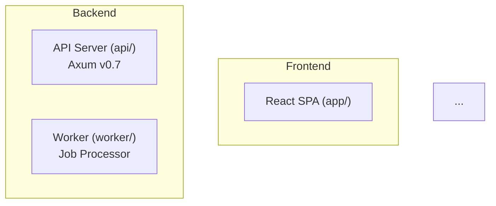
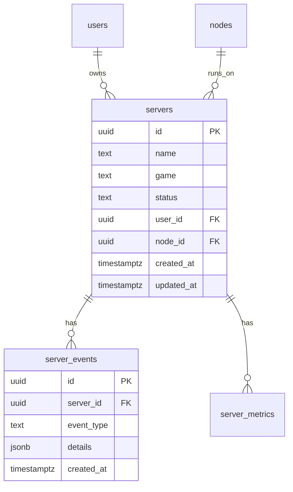

# Phase 64: Create Database Schema Documentation — Pattern Map

**Mapped:** 2026-05-31
**Files analyzed:** 9
**Analogs found:** 7 / 9

## File Classification

| New/Modified File | Role | Data Flow | Closest Analog | Match Quality |
|---|---|---|---|---|
| `DATABASE_SCHEMA.md` | documentation | static-output | `ARCHITECTURE.md` | role-match |
| `tools/db-schema-gen/Cargo.toml` | config | N/A | `worker/Cargo.toml` | role-match |
| `tools/db-schema-gen/src/main.rs` | controller (CLI) | batch/transform | `worker/src/main.rs` | role-match |
| `tools/db-schema-gen/src/introspector.rs` | service | CRUD (read-only) | `worker/src/config.rs` (connection pattern) | partial |
| `tools/db-schema-gen/src/rustdoc_reader.rs` | utility | file-I/O | `api/src/domain/entities/s3_profile.rs` (entity parse target) | partial |
| `tools/db-schema-gen/src/domain_classifier.rs` | utility | transform | `api/src/domain/entities/mod.rs` (table-name registry) | partial |
| `tools/db-schema-gen/src/mermaid_generator.rs` | utility | transform | `ARCHITECTURE.md` (Mermaid output pattern) | partial |
| `tools/db-schema-gen/src/markdown_builder.rs` | utility | transform | `ARCHITECTURE.md` / `DEVELOPMENT.md` (GFM table pattern) | partial |
| `tools/db-schema-gen/src/types.rs` | model | N/A | `api/src/domain/entities/s3_profile.rs` | role-match |

## Pattern Assignments

### `DATABASE_SCHEMA.md` (documentation, static-output)

**Analog:** `ARCHITECTURE.md` — existing repo-root doc with Mermaid diagrams, GFM tables, ATX headings, badge line, TOC

**Imports pattern — not applicable (Markdown)**

**Repo-root doc structure pattern** (lines 1-23):
```markdown
# Escluse — Architecture

Esluce is a game server management platform built as a distributed microservices architecture...


---

## Table of Contents

- [System Overview](#system-overview)
...
```

**Mermaid diagram pattern** (lines 30-61):
```markdown

```

**GFM table pattern** (lines 322-328):
```markdown
| Service | Language | Framework / Runtime | Database | Key Dependencies |
|---------|----------|-------------------|----------|------------------|
| API Backend | Rust (ed. 2021) | Axum v0.7 / Tokio v1 | PostgreSQL 16, Redis 7 | sqlx v0.7, jsonwebtoken v9, ssh2 v0.9, rcon v0.6 |
| Worker | Rust (ed. 2021) | Tokio v1 | PostgreSQL 16, Redis 7 | sqlx v0.7, reqwest v0.12 |
```

**Callout/admonition pattern** (line 91, from `DEVELOPMENT.md`):
```markdown
> **Warning:** `api/`, `app/`, `docs/`, `agent/solys/`, `agent/agent-core/`, ...
```

**Also reference `DEVELOPMENT.md` lines 1-10 for badge table format:**
```markdown
# Escluse — Local Development

Esluce is a game server management platform. This guide covers setting up the full development environment.


```

---

### `tools/db-schema-gen/Cargo.toml` (config, N/A)

**Analog:** `worker/Cargo.toml` — standalone Rust binary crate, same structure, same dependency pattern

**Imports/dependency pattern** (lines 1-27):
```toml
[package]
name = "worker"
version = "0.1.0"
edition = "2021"

[dependencies]
tokio = { version = "1", features = ["full"] }
serde = { version = "1", features = ["derive"] }
serde_json = "1"
tracing = "0.1"
tracing-subscriber = { version = "0.3", features = ["env-filter"] }
uuid = { version = "1", features = ["serde", "v4"] }
chrono = { version = "0.4", features = ["serde"] }
anyhow = "1"
thiserror = "1"
sqlx = { version = "0.7", features = ["postgres", "runtime-tokio-rustls", "uuid", "chrono", "macros"] }
```

**Generator-specific deps to add** (from RESEARCH.md):
- `clap = { version = "4", features = ["derive"] }` — CLI argument parsing
- `regex = "1"` — rustdoc annotation parsing
- `walkdir = "2"` — recursive `.rs` file traversal
- `indoc = "2"` — multi-line string formatting for Mermaid
- `unicode-width = "0.1"` — markdown column alignment (optional)

**Release profile pattern** (lines 25-27):
```toml
[profile.release]
opt-level = 3
lto = true
```

---

### `tools/db-schema-gen/src/main.rs` (controller/CLI, batch/transform)

**Analog:** `worker/src/main.rs` — `#[tokio::main]` binary entry point, module declarations, top-level orchestration

**Imports pattern** (lines 1-10):
```rust
use anyhow::Result;
use tracing::{info, error};
use tracing_subscriber;

mod config;
mod cron_eval;
mod prune;
mod queue;
mod agent;
mod webhook;
```

**Generator's module structure** (adapted analog):
```rust
mod introspector;
mod rustdoc_reader;
mod domain_classifier;
mod mermaid_generator;
mod markdown_builder;
mod types;
```

**Core entry point pattern** (lines 12-17):
```rust
#[tokio::main]
async fn main() -> Result<()> {
    tracing_subscriber::fmt()
        .with_env_filter("RUST_LOG")
        .init();

    info!("Generating DATABASE_SCHEMA.md...");
    // ... tool logic ...
    Ok(())
}
```

**CLI arg pattern** (from RESEARCH.md Example 1, lines 401-431):
```rust
use clap::Parser;

#[derive(Parser, Debug)]
#[command(name = "db-schema-gen", about = "Generate DATABASE_SCHEMA.md from PostgreSQL schema")]
struct Cli {
    /// PostgreSQL connection URL
    #[arg(short, long, env = "DATABASE_URL")]
    db_url: String,

    /// Output file path
    #[arg(short, long, default_value = "DATABASE_SCHEMA.md")]
    output: String,

    /// Path to Rust entity source files
    #[arg(short, long, default_value = "api/src/domain")]
    source_dir: String,
}

#[tokio::main]
async fn main() -> anyhow::Result<()> {
    let cli = Cli::parse();
    // ... orchestrate generator pipeline ...
    Ok(())
}
```

**Top-level orchestration** (from RESEARCH.md lines 424-430):
```rust
let schema = introspect_database(&cli.db_url).await?;
let annotations = read_rustdoc_annotations(&cli.source_dir)?;
let document = generate_markdown(schema, annotations);
std::fs::write(&cli.output, document)?;
println!("Generated {}", &cli.output);
```

---

### `tools/db-schema-gen/src/introspector.rs` (service, read-only CRUD)

**Analog:** No exact analog in codebase for information_schema queries. Pattern from RESEARCH.md Example 2.

**Imports pattern:**
```rust
use sqlx::PgPool;
use anyhow::Result;
use crate::types::{TableInfo, ColumnInfo, ForeignKey, IndexInfo};
```

**Core query pattern** (RESEARCH.md lines 438-461):
```rust
#[derive(Debug, sqlx::FromRow)]
struct TableInfo {
    table_name: String,
    table_comment: Option<String>,
}

async fn get_tables(pool: &PgPool) -> anyhow::Result<Vec<TableInfo>> {
    let tables = sqlx::query_as::<_, TableInfo>(
        r#"
        SELECT t.table_name,
               pgd.description AS table_comment
        FROM information_schema.tables t
        LEFT JOIN pg_catalog.pg_class pgc ON pgc.relname = t.table_name
        LEFT JOIN pg_catalog.pg_description pgd ON pgd.objoid = pgc.oid
            AND pgd.objsubid = 0
        WHERE t.table_schema = 'public'
          AND t.table_type = 'BASE TABLE'
        ORDER BY t.table_name
        "#
    )
    .fetch_all(pool)
    .await?;
    Ok(tables)
}
```

**Connection pattern** (from `worker/src/main.rs` lines 23-27):
```rust
let pool = sqlx::postgres::PgPoolOptions::new()
    .max_connections(5)
    .connect(&config.database_url)
    .await
    .expect("Failed to connect to PostgreSQL");
```

**Additional queries needed** (from RESEARCH.md lines 156-203):
```sql
-- Columns with metadata
SELECT c.column_name, c.ordinal_position, c.is_nullable, 
       c.data_type, c.character_maximum_length, c.column_default,
       pgd.description AS column_comment
FROM information_schema.columns c
LEFT JOIN pg_catalog.pg_statio_all_tables st 
    ON st.schemaname = c.table_schema AND st.relname = c.table_name
LEFT JOIN pg_catalog.pg_description pgd 
    ON pgd.objoid = st.relid AND pgd.objsubid = c.ordinal_position
WHERE c.table_schema = 'public' AND c.table_name = $1
ORDER BY c.ordinal_position;

-- Foreign keys
SELECT kcu.column_name, 
       ccu.table_schema AS foreign_table_schema,
       ccu.table_name AS foreign_table_name,
       ccu.column_name AS foreign_column_name,
       rc.update_rule, rc.delete_rule
FROM information_schema.table_constraints tc
JOIN information_schema.key_column_usage kcu 
    ON tc.constraint_name = kcu.constraint_name
JOIN information_schema.referential_constraints rc 
    ON tc.constraint_name = rc.constraint_name
JOIN information_schema.constraint_column_usage ccu 
    ON rc.unique_constraint_name = ccu.constraint_name
WHERE tc.constraint_type = 'FOREIGN KEY' 
    AND tc.table_name = $1;

-- Indexes
SELECT indexname, indexdef 
FROM pg_indexes 
WHERE schemaname = 'public' AND tablename = $1
ORDER BY indexname;

-- Enum types
SELECT t.typname, e.enumlabel
FROM pg_type t
JOIN pg_enum e ON t.oid = e.enumtypid
ORDER BY t.typname, e.enumsortorder;
```

**Error handling pattern** — use `anyhow::Result` throughout (from `worker/src/config.rs` line 1):
```rust
use anyhow::{Context, Result};
```

---

### `tools/db-schema-gen/src/rustdoc_reader.rs` (utility, file-I/O)

**Analog:** No direct analog in codebase. Pattern from RESEARCH.md Example 3.

**Imports pattern:**
```rust
use regex::Regex;
use anyhow::Result;
use std::path::Path;
use crate::types::EntityDoc;
```

**Core regex parsing pattern** (RESEARCH.md lines 475-507):
```rust
fn parse_entity_docs(source_dir: &str) -> anyhow::Result<Vec<EntityDoc>> {
    let re_struct = Regex::new(r"pub struct (\w+)")?;
    let re_doc = Regex::new(r"^\s*///\s?(.*)$")?;
    let mut entities = Vec::new();

    for entry in walkdir::WalkDir::new(source_dir)
        .into_iter()
        .filter_map(|e| e.ok())
        .filter(|e| e.file_name().to_string_lossy().ends_with(".rs"))
    {
        let content = std::fs::read_to_string(entry.path())?;
        let mut current_doc: Vec<String> = Vec::new();
        let mut current_struct: Option<String> = None;

        for line in content.lines() {
            if let Some(cap) = re_doc.captures(line) {
                current_doc.push(cap[1].to_string());
            } else if let Some(cap) = re_struct.captures(line) {
                if !current_doc.is_empty() {
                    entities.push(EntityDoc {
                        struct_name: cap[1].to_string(),
                        doc_lines: current_doc.clone(),
                    });
                }
                current_doc.clear();
            } else {
                current_doc.clear(); // non-doc line resets
            }
        }
    }
    Ok(entities)
}
```

**Entity struct pattern being parsed** (from `api/src/domain/entities/s3_profile.rs` lines 5-8):
```rust
/// Named S3-compatible storage profile (D-14).
/// Managed by admins in platform settings, selectable per server.
#[derive(Debug, Clone, Serialize, Deserialize)]
pub struct S3Profile {
```

**Entities without annotations** (fallback case, from `api/src/domain/entities/server.rs` lines 5-6):
```rust
#[derive(Debug, Clone, Serialize, Deserialize)]
pub struct Server {
```

---

### `tools/db-schema-gen/src/domain_classifier.rs` (utility, transform)

**Analog:** `api/src/domain/entities/mod.rs` — module registry mapping entity names to files

**Existing module registry pattern** (lines 1-16):
```rust
pub mod alert;
pub mod alert_state;
pub mod backup;
pub mod backup_config;
pub mod cron_task;
pub mod node;
pub mod node_api_key;
pub mod node_health;
pub mod node_metrics;
pub mod node_registration_token;
pub mod server;
pub mod server_metrics;
pub mod cloudflare_settings;
pub mod s3_profile;
pub mod server_crash_log;
pub mod settings;
```

**Core domain mapping pattern** — hardcoded `HashMap` lookup (from RESEARCH.md lines 248-277):
```rust
use std::collections::HashMap;

/// Maps business domains to their table names
fn get_domain_map() -> HashMap<&'static str, Vec<&'static str>> {
    let mut map = HashMap::new();
    map.insert("Servers", vec![
        "servers", "server_events", "server_metrics", "server_crash_logs",
    ]);
    map.insert("Nodes", vec![
        "nodes", "node_metrics", "node_events", "server_nodes",
        "node_api_keys", "node_registration_tokens",
    ]);
    map.insert("Users/Auth", vec![
        "users", "api_keys", "roles", "permissions", "user_roles",
    ]);
    map.insert("Billing/Subscriptions", vec![
        "plans", "subscriptions", "billing_customers",
        "payment_transactions", "invoices", "refunds", "usage_tracking",
    ]);
    map.insert("Backups", vec![
        "backup_history", "s3_profiles",
    ]);
    map.insert("Settings/Config", vec![
        "app_settings", "cron_tasks",
    ]);
    map.insert("Events/Logs", vec![
        "audit_logs", "alert_rules", "alert_states", "alert_history",
    ]);
    map.insert("Jobs", vec!["jobs"]);
    map.insert("Templates", vec![
        "templates", "modpack_templates", "plugin_templates",
    ]);
    map.insert("Games", vec![
        "game_types", "port_pools", "resource_plans", "deployment_configs",
    ]);
    map.insert("Webhooks", vec!["webhooks"]);
    map.insert("Infrastructure", vec![
        "agents", "node_api_keys", "node_registration_tokens",
    ]);
    map
}
```

**Table-to-entity name mapping** (from RESEARCH.md lines 212-219):
```rust
/// Maps table names to their corresponding entity struct names
/// for cases where PascalCase→snake_case doesn't apply
fn get_table_to_entity_map() -> HashMap<&'static str, &'static str> {
    let mut map = HashMap::new();
    map.insert("backup_history", "BackupRecord");
    map.insert("app_settings", "AppSettings");
    // All others follow convention: table_name → PascalCase singular
    map
}
```

**Foreign key relationship clusters** (from RESEARCH.md lines 267-277):
```rust
struct RelationshipCluster {
    name: &'static str,
    tables: Vec<&'static str>,
    description: &'static str,
}

fn get_clusters() -> Vec<RelationshipCluster> {
    vec![
        RelationshipCluster {
            name: "Users & Auth",
            tables: vec!["users", "api_keys", "roles", "permissions", "user_roles"],
            description: "Users, roles, permissions, and API key management",
        },
        RelationshipCluster {
            name: "Servers & Events",
            tables: vec!["servers", "server_events", "server_metrics", "server_crash_logs", "cron_tasks"],
            description: "Game server records with their event logs, metrics, and crash forensic data",
        },
        RelationshipCluster {
            name: "Nodes & Infrastructure",
            tables: vec!["nodes", "node_metrics", "node_events", "node_api_keys", "node_registration_tokens", "server_nodes"],
            description: "Compute node registration, monitoring, and authentication",
        },
        // ... 7 more clusters
    ]
}
```

---

### `tools/db-schema-gen/src/mermaid_generator.rs` (utility, transform)

**Analog:** No direct codebase analog. Pattern from RESEARCH.md Example 4.

**Imports pattern:**
```rust
use crate::types::{TableCluster, TableInfo, ColumnInfo, Relationship};
```

**Core Mermaid generation pattern** (RESEARCH.md lines 512-542):
```rust
fn generate_er_diagram(tables: &[TableCluster]) -> String {
    let mut output = String::from("```mermaid\nerDiagram\n");

    for table in tables {
        output.push_str(&format!("    {} {{\n", table.name));
        for col in &table.columns {
            let pk_marker = if col.is_pk { " PK" } else { "" };
            let fk_marker = if col.is_fk { " FK" } else { "" };
            output.push_str(&format!(
                "        {}{}{} {}\n",
                col.data_type, pk_marker, col.name, fk_marker
            ));
        }
        output.push_str("    }\n");
    }

    for rel in &table.relationships {
        output.push_str(&format!(
            "    {} {} {} {} {}\n",
            rel.parent_table,
            rel.parent_cardinality,
            rel.child_table,
            rel.child_cardinality,
            rel.description,
        ));
    }

    output.push_str("```\n");
    output
}
```

**Expected Mermaid output** (from RESEARCH.md lines 545-596):


---

### `tools/db-schema-gen/src/markdown_builder.rs` (utility, transform)

**Analog:** No direct codebase analog. Pattern from RESEARCH.md Example 6 and existing docs format.

**Imports pattern:**
```rust
use crate::types::{DomainSection, TableInfo, ColumnInfo, RelationshipCluster};
```

**Core Markdown table generation pattern** (from RESEARCH.md lines 598-612):
```rust
fn generate_table_section(table: &TableInfo) -> String {
    let mut output = format!("### `{}`\n\n", table.name);
    
    // Table header
    output.push_str("| Column | Type | Constraints | Description |\n");
    output.push_str("|--------|------|-------------|-------------|\n");

    // Rows
    for col in &table.columns {
        let constraints = build_constraints_string(col);
        let description = col.description.as_deref().unwrap_or("");
        output.push_str(&format!(
            "| `{}` | `{}` | {} | {} |\n",
            col.name, col.data_type, constraints, description,
        ));
    }

    output.push('\n');
    output
}
```

**Domain section builder pattern:**
```rust
fn generate_domain_section(domain: &DomainSection) -> String {
    let mut output = String::new();

    // Section heading
    output.push_str(&format!("## {} Tables\n\n", domain.name));
    output.push_str(&format!("{}\n\n", domain.description));

    // ER diagram
    output.push_str(&mermaid_generator::generate_er_diagram(&domain.clusters));
    output.push('\n');

    // Table details
    for table in &domain.tables {
        output.push_str(&generate_table_section(table));
    }

    // Query patterns
    if let Some(queries) = &domain.query_patterns {
        output.push_str("### Common Query Patterns\n\n");
        for q in queries {
            output.push_str(&format!("```sql\n{}\n```\n\n", q));
        }
    }

    // Design rationale
    if let Some(rationale) = &domain.design_rationale {
        output.push_str(&format!("### Design Rationale\n\n{}\n\n", rationale));
    }

    output
}
```

**Section heading pattern** (from `ARCHITECTURE.md` line 26):
```markdown
## System Overview
```

---

### `tools/db-schema-gen/src/types.rs` (model, N/A)

**Analog:** `api/src/domain/entities/s3_profile.rs` — struct definition pattern with derive macros, serde, type annotations

**Imports pattern** (from `s3_profile.rs` lines 1-3):
```rust
use chrono::{DateTime, Utc};
use serde::{Deserialize, Serialize};
use uuid::Uuid;
```

**Internal data type definitions** (from RESEARCH.md lines 438-442):
```rust
#[derive(Debug, Clone)]
pub struct TableInfo {
    pub table_name: String,
    pub table_comment: Option<String>,
    pub columns: Vec<ColumnInfo>,
    pub foreign_keys: Vec<ForeignKey>,
    pub indexes: Vec<IndexInfo>,
}

#[derive(Debug, Clone)]
pub struct ColumnInfo {
    pub name: String,
    pub ordinal_position: i32,
    pub data_type: String,      // Mapped to developer-friendly names
    pub is_nullable: bool,
    pub is_pk: bool,
    pub is_fk: bool,
    pub default: Option<String>,
    pub description: Option<String>,
    pub max_length: Option<i32>,
}

#[derive(Debug, Clone)]
pub struct ForeignKey {
    pub column_name: String,
    pub foreign_table_name: String,
    pub foreign_column_name: String,
    pub update_rule: String,
    pub delete_rule: String,
}

#[derive(Debug, Clone)]
pub struct IndexInfo {
    pub index_name: String,
    pub index_definition: String,
}

#[derive(Debug, Clone)]
pub struct EntityDoc {
    pub struct_name: String,
    pub doc_lines: Vec<String>,
}

#[derive(Debug, Clone)]
pub struct DomainSection {
    pub name: String,
    pub description: String,
    pub tables: Vec<TableInfo>,
    pub clusters: Vec<TableCluster>,
    pub query_patterns: Option<Vec<String>>,
    pub design_rationale: Option<String>,
}

#[derive(Debug, Clone)]
pub struct TableCluster {
    pub name: String,
    pub tables: Vec<TableInfo>,
    pub relationships: Vec<Relationship>,
}

#[derive(Debug, Clone)]
pub struct Relationship {
    pub parent_table: String,
    pub child_table: String,
    pub parent_cardinality: String,  // "||" or "|o"
    pub child_cardinality: String,   // "o{" or "||"
    pub description: String,         // e.g., "has", "owns", "runs_on"
}
```

**PostgreSQL type mapping function** (from RESEARCH.md Pitfall 2, lines 380-384):
```rust
/// Maps PostgreSQL internal type names to developer-friendly names
fn map_pg_type(pg_type: &str, udt_name: Option<&str>) -> &'static str {
    match pg_type {
        "uuid" => "uuid",
        "text" | "character varying" | "character" => "text",
        "integer" | "bigint" | "smallint" => "integer",
        "boolean" => "bool",
        "real" | "double precision" | "numeric" => "real",
        "timestamp with time zone" | "timestamp without time zone" => "timestamptz",
        "jsonb" | "json" => "jsonb",
        "USER-DEFINED" => udt_name.unwrap_or("enum"),
        _ => pg_type,
    }
}
```

## Shared Patterns

### Entry Point Pattern (tokio + clap)
**Source:** `worker/src/main.rs` (lines 1-17)
**Apply to:** `tools/db-schema-gen/src/main.rs`
```rust
use anyhow::Result;
use tracing::info;
use clap::Parser;

#[derive(Parser, Debug)]
#[command(name = "...", about = "...")]
struct Cli { ... }

#[tokio::main]
async fn main() -> Result<()> {
    tracing_subscriber::fmt().with_env_filter("RUST_LOG").init();
    let cli = Cli::parse();
    // ... pipeline ...
    Ok(())
}
```

### PostgreSQL Connection Pattern
**Source:** `worker/src/main.rs` (lines 23-27)
**Apply to:** `tools/db-schema-gen/src/introspector.rs`
```rust
let pool = sqlx::postgres::PgPoolOptions::new()
    .max_connections(5)
    .connect(&config.database_url)
    .await
    .expect("Failed to connect to PostgreSQL");
```

### Cargo.toml Standalone Binary Pattern
**Source:** `worker/Cargo.toml` (lines 1-27)
**Apply to:** `tools/db-schema-gen/Cargo.toml`
```toml
[package]
name = "db-schema-gen"
version = "0.1.0"
edition = "2021"

[dependencies]
# ... standard deps + clap, regex, walkdir, indoc, unicode-width

[profile.release]
opt-level = 3
lto = true
```

### Entity Struct Definition Pattern
**Source:** `api/src/domain/entities/s3_profile.rs` (lines 5-20)
**Apply to:** `tools/db-schema-gen/src/types.rs`
```rust
/// Named S3-compatible storage profile (D-14).
/// Managed by admins in platform settings, selectable per server.
#[derive(Debug, Clone, Serialize, Deserialize)]
pub struct S3Profile {
    pub id: Uuid,
    pub name: String,
    # ...
}
```
Note: `types.rs` only needs `#[derive(Debug, Clone)]` — no serde needed for internal types.

### Repo-Root Doc Badge + TOC Pattern
**Source:** `ARCHITECTURE.md` (lines 1-23)
**Apply to:** `DATABASE_SCHEMA.md`
```markdown
# Escluse — [Title]

[Description paragraph]


---

## Table of Contents

- [Section 1](#section-1)
- [Section 2](#section-2)
```

### GFM Table Format for Developer Docs
**Source:** `ARCHITECTURE.md` (lines 322-328)
**Apply to:** `DATABASE_SCHEMA.md` column-level tables
```markdown
| Service | Language | Framework / Runtime | Database | Key Dependencies |
|---------|----------|-------------------|----------|------------------|
| API Backend | Rust (ed. 2021) | Axum v0.7 | PostgreSQL 16 | sqlx v0.7 |
```

### Error Handling Pattern
**Source:** `worker/src/config.rs` (line 1) and `api/src/main.rs` (line 6)
**Apply to:** All generator .rs files
```rust
use anyhow::{Context, Result};
// ...
let value = env::var("VAR").context("VAR must be set")?;
```

## No Analog Found

Files with no close match in the codebase (planner should use RESEARCH.md patterns instead):

| File | Role | Data Flow | Reason |
|------|------|-----------|--------|
| `tools/db-schema-gen/src/introspector.rs` | service | read-only CRUD | No existing `information_schema` introspection code — this is a greenfield module. Use RESEARCH.md Example 2 queries. |
| `tools/db-schema-gen/src/rustdoc_reader.rs` | utility | file-I/O | No existing Rust source file parser — this is a new pattern. Use RESEARCH.md Example 3 regex pattern. |
| `tools/db-schema-gen/src/mermaid_generator.rs` | utility | transform | No existing Mermaid ER diagram generator — RESEARCH.md Example 4 provides full pattern. |
| `tools/db-schema-gen/src/markdown_builder.rs` | utility | transform | No existing structured markdown builder — RESEARCH.md Example 6 and existing docs (ARCHITECTURE.md, DEVELOPMENT.md) provide format reference. |

These 4 files have RESEARCH.md code examples that serve as de facto analogs. The planner should use those directly.

## Metadata

**Analog search scope:** `api/src/domain/entities/`, `api/src/main.rs`, `worker/`, `ARCHITECTURE.md`, `DEVELOPMENT.md`, `CONTRIBUTING.md`, `.planning/codebase/`
**Files scanned:** ~35 source files examined
**Pattern extraction date:** 2026-05-31
