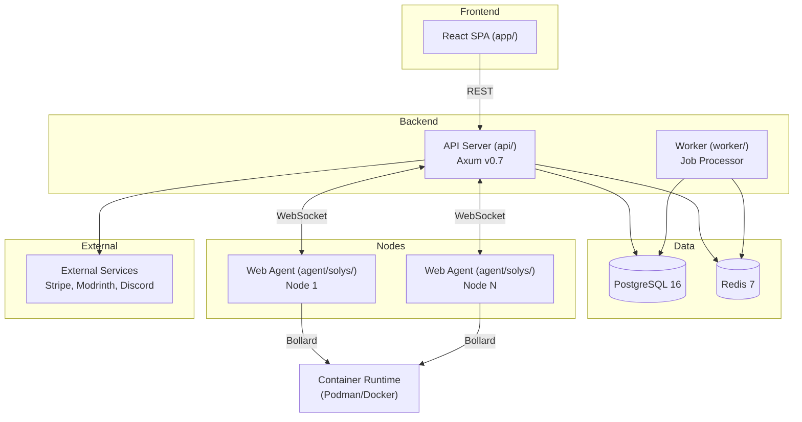
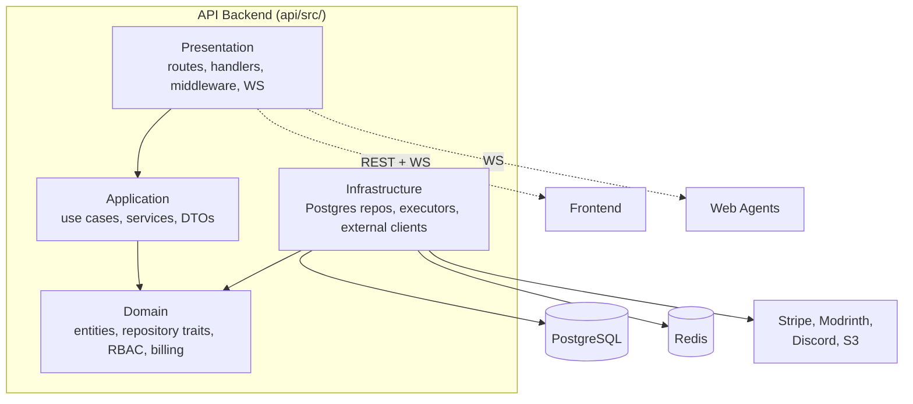
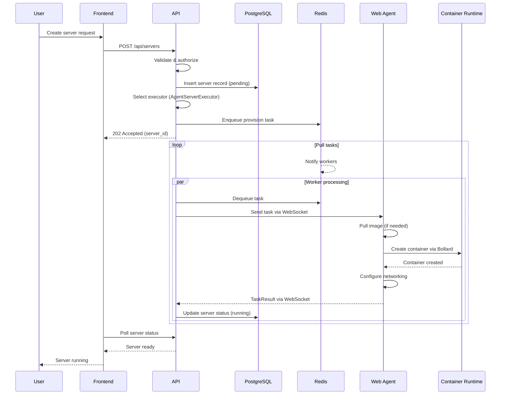
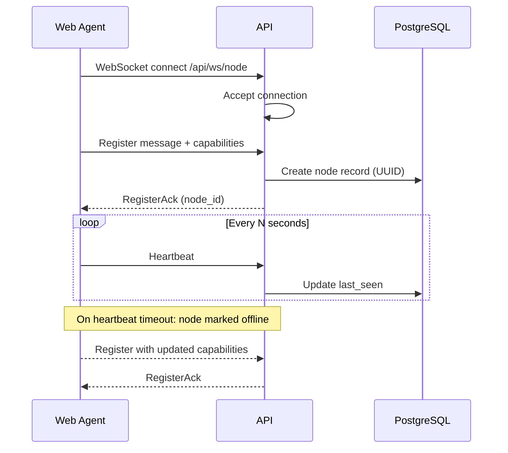
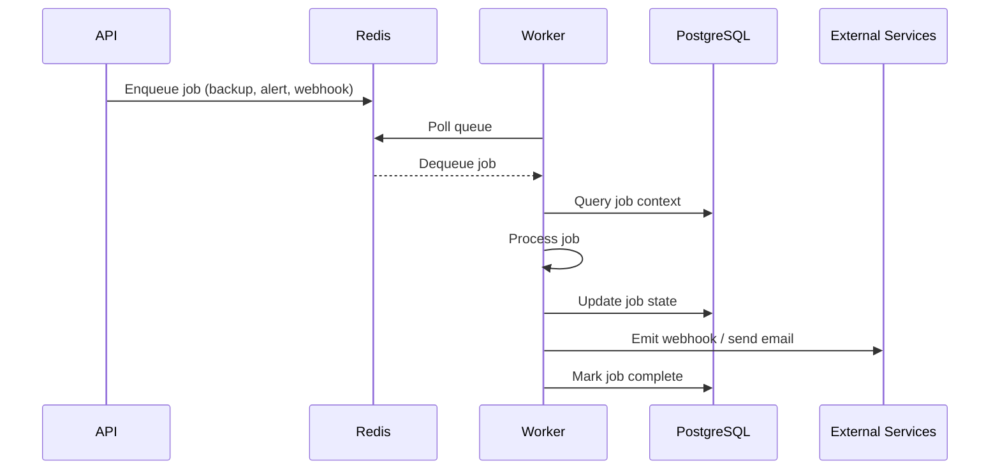
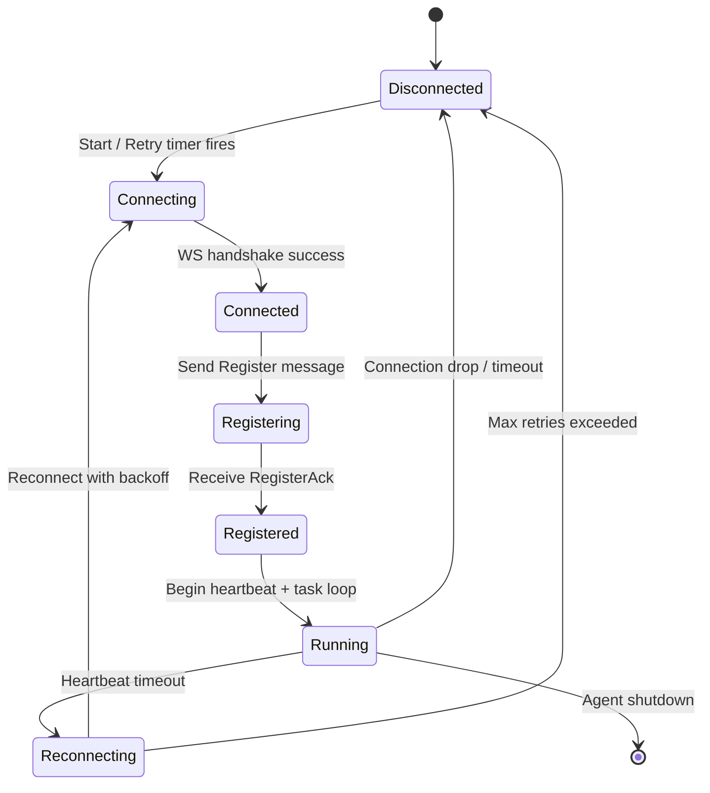
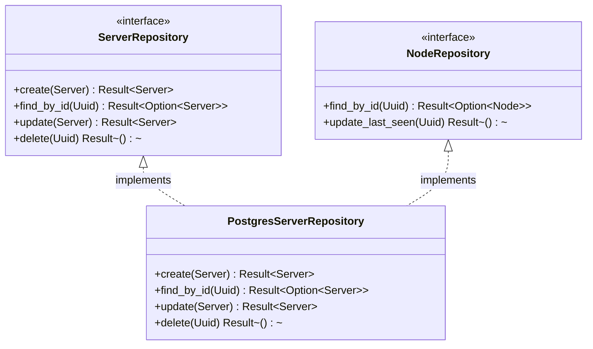

# Escluse — Architecture

Esluce is a game server management platform built as a distributed microservices architecture with agent-based node management. This document describes the system architecture — service boundaries, data flows, component relationships, and key abstractions for developers building on or extending the platform.


---

## Table of Contents

- [System Overview](#system-overview)
- [Service Architecture](#service-architecture)
- [Data Flows](#data-flows)
- [Key Abstractions](#key-abstractions)
- [Technology Stack](#technology-stack)
- [Module Reference](#module-reference)
- [Error Handling](#error-handling)
- [Cross-Cutting Concerns](#cross-cutting-concerns)
- [Next Steps](#next-steps)

---

## System Overview

Esluce follows a distributed microservices pattern: a central Rust API orchestrates server operations through lightweight Web Agents deployed on compute nodes, while a background Worker handles async jobs. The React frontend consumes REST APIs and communicates through the API layer. The meta-repo architecture (9 independent repositories under `esclusehq/`) is explained in [CONTRIBUTING.md](CONTRIBUTING.md).



The API backend employs Clean Architecture with four layers — Presentation, Application, Domain, Infrastructure — wired together via dependency injection (`AppContainer`). Web Agents maintain persistent WebSocket connections to the API for real-time task dispatch. The Worker processes Redis-backed job queues for long-running operations like backups and alert evaluation.

## Service Architecture

### API Backend (`api/`)

The central orchestration point for all operations. Built with Axum v0.7 and organized into four Clean Architecture layers with dependency injection.



- **Entry point:** `api/src/main.rs` (port 3000)
- **Architecture:** Clean Architecture with `AppContainer` DI
- **Used by:** Frontend (REST), Web Agents (WebSocket), Webhooks

### Worker Service (`worker/`)

Async job processor consuming Redis queues for long-running operations such as backups, plugin installations, and alert evaluation. Emits webhooks to external services upon job completion.

- **Entry point:** `worker/src/main.rs`
- **Key modules:** `queue.rs` (job processing), `agent/` (agent communication), `webhook/` (external callbacks)
- **Depends on:** Redis (queue), database (read/update job state)

### Web Agent (`agent/solys/`)

Lightweight Rust agent deployed on each compute node. Maintains a persistent WebSocket connection to the API backend for receiving tasks (server creation, backup, RCON commands, metrics collection) and reporting results.

- **Entry point:** `agent/solys/src/main.rs`
- **Key modules:** `agent_connection.rs` (WebSocket client with reconnection logic), `handlers/` (runtime, backup, rcon, metrics, ssh, sftp)
- **Depends on:** Backend WebSocket, Podman/Docker via Bollard v0.18
- **Behavior:** Reconnects with exponential backoff on connection loss, sends periodic heartbeats

### Frontend (`app/`)

React 19 single-page application with Vite, Tailwind CSS, and Zustand state management. Communicates with the backend via REST API.

- **Entry point:** `app/src/main.jsx`
- **Key directories:** `pages/` (screens), `components/` (reusable UI), `hooks/` (data fetching), `store/` (Zustand stores), `lib/` (API client)
- **Depends on:** Backend REST API, Supabase for authentication

### Agent-Core (`agent/agent-core/crates/`)

Rust workspace of 12 shared crates providing reusable agent functionality. Each crate is self-contained with a public API via `lib.rs`.

| Crate | Purpose |
|-------|---------|
| `agent-proto` | Task and result definitions, protocol messages |
| `agent-config` | Configuration loading and validation |
| `agent-runtime` | Docker/Podman runtime detection |
| `agent-ssh` | SSH client and connection pooling |
| `agent-rcon` | RCON client for game server management |
| `agent-backup` | Backup compression and storage utilities |
| `agent-health` | Health monitoring, circuit breakers, retry logic |
| `agent-metrics` | Metrics collection and reporting |
| `agent-task` | Task queue, dispatch, and execution tracking |
| `agent-security` | JWT verification, rate limiting, audit logging |
| `agent-event` | Event handling and propagation |
| `agent-capability` | Capability registry for runtime features |

## Data Flows

### Server Creation Flow

The core workflow: a user requests a new server, the API orchestrates provisioning, and a Web Agent creates the container on the target node.



### Agent Registration Flow

Web Agents register with the API backend on connect, providing their capabilities, and maintain presence through periodic heartbeats.



### Background Job Flow

The Worker service processes Redis-backed job queues for operations that don't require immediate synchronous responses.



### WebSocket Lifecycle

Web Agents transition through several states during their lifecycle, handling connection drops and reconnection with exponential backoff.



## Key Abstractions

### Repository Pattern

Database access is abstracted behind traits in the domain layer, with PostgreSQL implementations in infrastructure. This enables testability and separation of concerns.



```rust
// api/src/domain/repositories/server_repository.rs
pub trait ServerRepository: Send + Sync {
    async fn create(&self, server: Server) -> Result<Server>;
    async fn find_by_id(&self, id: Uuid) -> Result<Option<Server>>;
    async fn update(&self, server: Server) -> Result<Server>;
    async fn delete(&self, id: Uuid) -> Result<()>;
}
```

### Executor Factory

Server operations are dispatched through an executor abstraction, supporting multiple execution strategies (agent-based, SSH, RCON, mock).

```rust
// api/src/domain/factories/mod.rs
pub trait ExecutorFactory: Send + Sync {
    fn create_server_executor(&self, node_id: Uuid)
        -> Box<dyn ServerExecutor>;
}
```

Implementations include:
- `AgentServerExecutor` — dispatches via WebSocket to a node's Web Agent
- `SSHServerExecutor` — direct SSH to the target host
- `RCONServerExecutor` — RCON protocol for running servers
- `MockServerExecutor` — testing and development

### Task Dispatch (Agent-Core)

The `agent-task` crate provides a task dispatch abstraction used by Web Agents to route incoming tasks to the appropriate handler.

```rust
// agent-core/crates/agent-task/src/dispatcher.rs
pub trait TaskDispatcher: Send + Sync {
    async fn dispatch(&self, task: Task) -> Result<TaskResult>;
}
```

Each handler (runtime, backup, rcon, metrics, ssh, sftp) implements task processing with retry logic, timeout handling, and error reporting.

## Technology Stack

| Service | Language | Framework / Runtime | Database | Key Dependencies |
|---------|----------|-------------------|----------|------------------|
| API Backend | Rust (ed. 2021) | Axum v0.7 / Tokio v1 | PostgreSQL 16, Redis 7 | sqlx v0.7, jsonwebtoken v9, ssh2 v0.9, rcon v0.6 |
| Worker | Rust (ed. 2021) | Tokio v1 | PostgreSQL 16, Redis 7 | sqlx v0.7, reqwest v0.12 |
| Web Agent | Rust (ed. 2021) | Tokio v1 / Axum v0.8 | — | Bollard v0.18, tokio-tungstenite v0.26 |
| Frontend | TypeScript / JS | React v19.2 / Vite v7.3 | Supabase | Zustand v5, Tailwind CSS v4.2 |
| Agent-Core | Rust (ed. 2021) | Tokio v1 (workspace) | — | 12 crates (see above) |

## Module Reference

### API Backend (`api/src/`)

- **`domain/`** — Business entities, repository traits (server, node, backup, billing), domain services (auth, RBAC, webhook)
- **`application/use_cases/`** — 18+ use cases (create_server, start_server, stop_server, delete_server, send_command, port_allocation, etc.)
- **`application/services/`** — Background services (monitoring, webhook, backup, backup_scheduler, node_health)
- **`infrastructure/repositories/`** — Postgres implementations of domain repository traits
- **`infrastructure/executors/`** — Agent, SSH, RCON, and mock server executors
- **`infrastructure/billing/`** — Stripe and Lemon Squeezy integration
- **`infrastructure/external_services/`** — Modrinth (plugins), Discord webhooks
- **`presentation/routes/`** — HTTP route definitions (server, node, api, billing, openapi)
- **`presentation/handlers/`** — Request handlers for each resource
- **`presentation/middleware/`** — Auth, RBAC, rate limiting, CORS
- **`shared/`** — Constants, utilities, error types
- **`bootstrap/`** — App initialization, config loading, DI container (`AppContainer`)

### Web Agent (`agent/solys/src/`)

- **`main.rs`** — Entry point: loads config, establishes WebSocket connection
- **`agent_connection.rs`** — WebSocket client with reconnection logic, message serialization
- **`handlers/`** — Task handlers: `runtime.rs` (container create/start/stop), `backup.rs`, `rcon.rs`, `metrics.rs`, `ssh.rs`, `sftp.rs`
- **`task_state.rs`** — Task execution tracking and status reporting
- **`api/`** — Internal HTTP server for health checks and diagnostics

### Agent-Core (`agent/agent-core/crates/`)

Each crate is a standalone library under `crates/` within the `agent/agent-core/` workspace. See the [Service Architecture](#agent-core-agentagent-corecrates) table for the full list.

### Frontend (`app/src/`)

- **`main.jsx`** — Entry point, React DOM render
- **`app/`** — App component, router configuration
- **`pages/`** — Full page components (auth, dashboard, servers, billing, settings, console)
- **`components/`** — Reusable UI (Sidebar, IDE, FileManager, Toast, StatusBadge)
- **`hooks/`** — Custom React hooks (useServers, useNodes, useWebSocket, useBilling)
- **`store/`** — Zustand state stores (authStore, serverStore, uiStore)
- **`lib/`** — API client utilities, Supabase client configuration
- **`types/`** — TypeScript type definitions
- **`features/`** — Feature-specific component modules

## Error Handling

Centralized error types with application-specific codes across all services. Rust services use `anyhow::Result` for fallible operations with custom error types in `shared/errors/`. The Web Agent implements retry logic with exponential backoff for transient failures and a circuit breaker pattern (via the `agent-health` crate) for external service degradation.

## Cross-Cutting Concerns

- **Logging:** Structured logging via the `tracing` crate with `tracing-subscriber` across all Rust services
- **Validation:** Config validation in `agent-config` crate, request validation in API handlers, environment validation at startup
- **Authentication:** JWT-based authentication with RBAC middleware for role-based access control
- **Caching:** Redis-based session caching and rate limiting

## Next Steps

- **[DEVELOPMENT.md](DEVELOPMENT.md)** — Local development setup guide (how to run the full stack)
- **[CONTRIBUTING.md](CONTRIBUTING.md)** — How to contribute, meta-repo mapping, and contribution workflow
